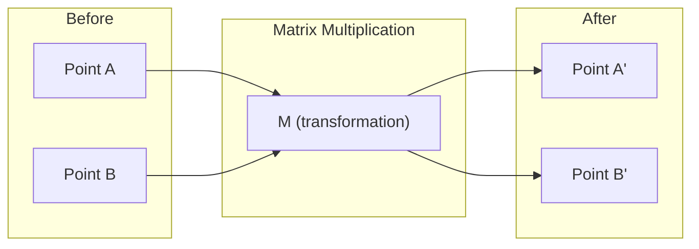
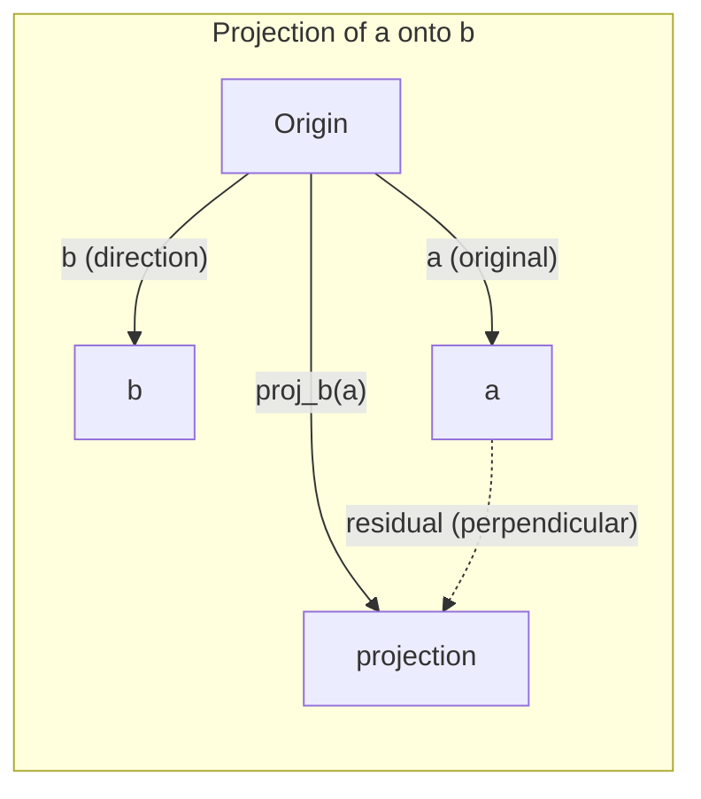

# 线性代数 (Linear Algebra) 直观理解

> 每一个 AI 模型 (AI Model) 都不过是戴了顶华丽帽子的矩阵数学 (Matrix Math)。

**类型:** 学习
**语言:** Python, Julia
**前置要求:** Phase 0
**时长:** 约 60 分钟

## 学习目标

- 从零开始使用 Python 实现向量 (vector) 与矩阵 (matrix) 运算（加法 (addition)、点积 (dot product)、矩阵乘法 (matrix multiplication)）
- 从几何角度解释点积、投影 (projection) 与格拉姆-施密特正交化过程 (Gram-Schmidt process) 的作用
- 使用行化简 (row reduction) 确定一组向量的线性无关性 (linear independence)、秩 (rank) 与基 (basis)
- 将线性代数 (linear algebra) 概念与其在 AI 中的应用相联系：嵌入 (embeddings)、注意力分数 (attention scores) 与 LoRA

## 问题

随便打开一篇机器学习 (Machine Learning) 论文。在第一页中，你就会看到向量 (vectors)、矩阵 (matrices)、点积 (dot products) 和变换 (transformations)。如果缺乏线性代数 (linear algebra) 的直觉，这些就只是一堆符号。但有了它，你就能看清神经网络 (neural network) 实际上在做什么——在空间中移动点。

你不需要成为数学家。你需要从几何角度理解这些运算的含义，然后亲手将它们编写成代码。

## 概念

### Vectors Are Points (and Directions)

A vector is just a list of numbers. But those numbers mean something -- they're coordinates in space.

**2D vector [3, 2]:**

| x | y | Point |
|---|---|-------|
| 3 | 2 | The vector points from origin (0,0) to (3, 2) on the plane |

The vector has magnitude sqrt(3^2 + 2^2) = sqrt(13) and points up and to the right.

In AI, vectors represent everything:
- A word → a vector of 768 numbers (its "meaning" in embedding space)
- An image → a vector of millions of pixel values
- A user → a vector of preferences

### Matrices Are Transformations

A matrix transforms one vector into another. It can rotate, scale, stretch, or project.



In AI, matrices ARE the model:
- Neural network weights → matrices that transform input into output
- Attention scores → matrices that decide what to focus on
- Embeddings → matrices that map words to vectors

### The Dot Product Measures Similarity

The dot product of two vectors tells you how similar they are.

```
a · b = a₁×b₁ + a₂×b₂ + ... + aₙ×bₙ

Same direction:      a · b > 0  (similar)
Perpendicular:       a · b = 0  (unrelated)
Opposite direction:  a · b < 0  (dissimilar)
```

This is literally how search engines, recommendation systems, and RAG work -- find vectors with high dot products.

### Linear Independence

Vectors are linearly independent if no vector in the set can be written as a combination of the others. If v1, v2, v3 are independent, they span a 3D space. If one is a combination of the others, they only span a plane.

Why it matters for AI: your feature matrix should have linearly independent columns. If two features are perfectly correlated (linearly dependent), the model cannot distinguish their effects. This causes multicollinearity in regression -- the weight matrix becomes unstable, and small input changes produce wild output swings.

**Concrete example:**

```
v1 = [1, 0, 0]
v2 = [0, 1, 0]
v3 = [2, 1, 0]   # v3 = 2*v1 + v2
```

v1 and v2 are independent -- neither is a scalar multiple or combination of the other. But v3 = 2*v1 + v2, so {v1, v2, v3} is a dependent set. These three vectors all lie in the xy-plane. No matter how you combine them, you cannot reach [0, 0, 1]. You have three vectors but only two dimensions of freedom.

In a dataset: if feature_3 = 2*feature_1 + feature_2, adding feature_3 gives the model zero new information. Worse, it makes the normal equations singular -- there is no unique solution for the weights.

### Basis and Rank

A basis is a minimal set of linearly independent vectors that span the entire space. The number of basis vectors is the dimension of the space.

The standard basis for 3D space is {[1,0,0], [0,1,0], [0,0,1]}. But any three independent vectors in 3D form a valid basis. The choice of basis is a choice of coordinate system.

Rank of a matrix = number of linearly independent columns = number of linearly independent rows. If rank < min(rows, cols), the matrix is rank-deficient. This means:
- The system has infinitely many solutions (or none)
- Information is lost in the transformation
- The matrix cannot be inverted

| Situation | Rank | What it means for ML |
|-----------|------|---------------------|
| Full rank (rank = min(m, n)) | Maximum possible | Unique least-squares solution exists. Model is well-conditioned. |
| Rank deficient (rank < min(m, n)) | Below maximum | Features are redundant. Infinitely many weight solutions. Regularization needed. |
| Rank 1 | 1 | Every column is a scaled copy of one vector. All data lies on a line. |
| Near rank-deficient (small singular values) | Numerically low | Matrix is ill-conditioned. Tiny input noise causes large output changes. Use SVD truncation or ridge regression. |

### Projection

Projecting vector **a** onto vector **b** gives the component of **a** in the direction of **b**:

```
proj_b(a) = (a dot b / b dot b) * b
```

The residual (a - proj_b(a)) is perpendicular to b. This orthogonal decomposition is the foundation of least-squares fitting.

Projection is everywhere in ML:
- Linear regression minimizes the distance from observations to the column space -- the solution IS a projection
- PCA projects data onto the directions of maximum variance
- Attention in transformers computes projections of queries onto keys



**Example:** a = [3, 4], b = [1, 0]

proj_b(a) = (3*1 + 4*0) / (1*1 + 0*0) * [1, 0] = 3 * [1, 0] = [3, 0]

The projection drops the y-component. This is dimensionality reduction in its simplest form -- throw away the directions you don't care about.

### Gram-Schmidt Process

Converting any set of independent vectors into an orthonormal basis. Orthonormal means every vector has length 1 and every pair is perpendicular.

The algorithm:
1. Take the first vector, normalize it
2. Take the second vector, subtract its projection onto the first, normalize
3. Take the third vector, subtract its projections onto all previous vectors, normalize
4. Repeat for remaining vectors

```
Input:  v1, v2, v3, ... (linearly independent)

u1 = v1 / |v1|

w2 = v2 - (v2 dot u1) * u1
u2 = w2 / |w2|

w3 = v3 - (v3 dot u1) * u1 - (v3 dot u2) * u2
u3 = w3 / |w3|

Output: u1, u2, u3, ... (orthonormal basis)
```

This is how QR decomposition works internally. Q is the orthonormal basis, R captures the projection coefficients. QR decomposition is used in:
- Solving linear systems (more stable than Gaussian elimination)
- Computing eigenvalues (QR algorithm)
- Least-squares regression (the standard numerical method)

## 构建

### 步骤 1：从零实现向量 (Vector)（Python）

class Vector:
    def __init__(self, components):
        self.components = list(components)
        self.dim = len(self.components)

    def __add__(self, other):
        return Vector([a + b for a, b in zip(self.components, other.components)])

    def __sub__(self, other):
        return Vector([a - b for a, b in zip(self.components, other.components)])

    def dot(self, other):
        return sum(a * b for a, b in zip(self.components, other.components))

    def magnitude(self):
        return sum(x**2 for x in self.components) ** 0.5

    def normalize(self):
        mag = self.magnitude()
        return Vector([x / mag for x in self.components])

    def cosine_similarity(self, other):
        return self.dot(other) / (self.magnitude() * other.magnitude())

    def __repr__(self):
        return f"Vector({self.components})"


a = Vector([1, 2, 3])
b = Vector([4, 5, 6])

print(f"a + b = {a + b}")
print(f"a · b = {a.dot(b)}")
print(f"|a| = {a.magnitude():.4f}")
print(f"cosine similarity = {a.cosine_similarity(b):.4f}")

### 步骤 2：从零实现矩阵 (Matrix)（Python）

class Matrix:
    def __init__(self, rows):
        self.rows = [list(row) for row in rows]
        self.shape = (len(self.rows), len(self.rows[0]))

    def __matmul__(self, other):
        if isinstance(other, Vector):
            return Vector([
                sum(self.rows[i][j] * other.components[j] for j in range(self.shape[1]))
                for i in range(self.shape[0])
            ])
        rows = []
        for i in range(self.shape[0]):
            row = []
            for j in range(other.shape[1]):
                row.append(sum(
                    self.rows[i][k] * other.rows[k][j]
                    for k in range(self.shape[1])
                ))
            rows.append(row)
        return Matrix(rows)

    def transpose(self):
        return Matrix([
            [self.rows[j][i] for j in range(self.shape[0])]
            for i in range(self.shape[1])
        ])

    def __repr__(self):
        return f"Matrix({self.rows})"


rotation_90 = Matrix([[0, -1], [1, 0]])
point = Vector([3, 1])

rotated = rotation_90 @ point
print(f"Original: {point}")
print(f"Rotated 90°: {rotated}")

### 步骤 3：为什么这对人工智能 (AI) 至关重要

import random

random.seed(42)
weights = Matrix([[random.gauss(0, 0.1) for _ in range(3)] for _ in range(2)])
input_vector = Vector([1.0, 0.5, -0.3])

output = weights @ input_vector
print(f"Input (3D): {input_vector}")
print(f"Output (2D): {output}")
print("This is what a neural network layer does -- matrix multiplication.")

### 步骤 4：Julia 版本

a = [1.0, 2.0, 3.0]
b = [4.0, 5.0, 6.0]

println("a + b = ", a + b)
println("a · b = ", a ⋅ b)       # Julia supports unicode operators
println("|a| = ", √(a ⋅ a))
println("cosine = ", (a ⋅ b) / (√(a ⋅ a) * √(b ⋅ b)))

# Matrix-vector multiplication
W = [0.1 -0.2 0.3; 0.4 0.5 -0.1]
x = [1.0, 0.5, -0.3]
println("Wx = ", W * x)
println("This is a neural network layer.")

### 步骤 5：从零实现线性无关 (Linear Independence) 与投影 (Projection)（Python）

def is_linearly_independent(vectors):
    n = len(vectors)
    dim = len(vectors[0].components)
    mat = Matrix([v.components[:] for v in vectors])
    rows = [row[:] for row in mat.rows]
    rank = 0
    for col in range(dim):
        pivot = None
        for row in range(rank, len(rows)):
            if abs(rows[row][col]) > 1e-10:
                pivot = row
                break
        if pivot is None:
            continue
        rows[rank], rows[pivot] = rows[pivot], rows[rank]
        scale = rows[rank][col]
        rows[rank] = [x / scale for x in rows[rank]]
        for row in range(len(rows)):
            if row != rank and abs(rows[row][col]) > 1e-10:
                factor = rows[row][col]
                rows[row] = [rows[row][j] - factor * rows[rank][j] for j in range(dim)]
        rank += 1
    return rank == n


def project(a, b):
    scalar = a.dot(b) / b.dot(b)
    return Vector([scalar * x for x in b.components])


def gram_schmidt(vectors):
    orthonormal = []
    for v in vectors:
        w = v
        for u in orthonormal:
            proj = project(w, u)
            w = w - proj
        if w.magnitude() < 1e-10:
            continue
        orthonormal.append(w.normalize())
    return orthonormal


v1 = Vector([1, 0, 0])
v2 = Vector([1, 1, 0])
v3 = Vector([1, 1, 1])
basis = gram_schmidt([v1, v2, v3])
for i, u in enumerate(basis):
    print(f"u{i+1} = {u}")
    print(f"  |u{i+1}| = {u.magnitude():.6f}")

print(f"u1 · u2 = {basis[0].dot(basis[1]):.6f}")
print(f"u1 · u3 = {basis[0].dot(basis[2]):.6f}")
print(f"u2 · u3 = {basis[1].dot(basis[2]):.6f}")


## 使用方法

现在使用 NumPy 实现同样的功能——这也是你在实际开发中真正会用到的：

import numpy as np

a = np.array([1, 2, 3], dtype=float)
b = np.array([4, 5, 6], dtype=float)

print(f"a + b = {a + b}")
print(f"a · b = {np.dot(a, b)}")
print(f"|a| = {np.linalg.norm(a):.4f}")
print(f"cosine = {np.dot(a, b) / (np.linalg.norm(a) * np.linalg.norm(b)):.4f}")

W = np.random.randn(2, 3) * 0.1
x = np.array([1.0, 0.5, -0.3])
print(f"Wx = {W @ x}")

### 使用 NumPy 计算秩 (Rank)、投影 (Projection) 与 QR 分解 (QR Decomposition)

import numpy as np

A = np.array([[1, 2], [2, 4]])
print(f"Rank: {np.linalg.matrix_rank(A)}")

a = np.array([3, 4])
b = np.array([1, 0])
proj = (np.dot(a, b) / np.dot(b, b)) * b
print(f"Projection of {a} onto {b}: {proj}")

Q, R = np.linalg.qr(np.random.randn(3, 3))
print(f"Q is orthogonal: {np.allclose(Q @ Q.T, np.eye(3))}")
print(f"R is upper triangular: {np.allclose(R, np.triu(R))}")

### PyTorch —— 张量 (Tensor) 是带有自动微分 (Autodiff) 的向量

import torch

x = torch.randn(3, requires_grad=True)
y = torch.tensor([1.0, 0.0, 0.0])

similarity = torch.dot(x, y)
similarity.backward()

print(f"x = {x.data}")
print(f"y = {y.data}")
print(f"dot product = {similarity.item():.4f}")
print(f"d(dot)/dx = {x.grad}")

点积 (Dot Product) 关于 x 的梯度 (Gradient) 就是 y。PyTorch 自动完成了这一计算。神经网络中的每一个操作都是由这类基础运算构建而成的——包括矩阵乘法 (Matrix Multiplication)、点积和投影——而自动微分会追踪所有这些操作中的梯度传播。

你刚刚从零开始实现了 NumPy 一行代码就能完成的功能。现在，你已经清楚了底层究竟是如何运作的。

## 发布上线

本课时将生成：
- `outputs/prompt-linear-algebra-tutor.md` -- 一份提示词 (prompt)，用于指导 AI 助手 (AI assistants) 借助几何直观 (geometric intuition) 教授线性代数 (linear algebra)

## 连接

本课中的所有内容都与现代人工智能的特定部分紧密相连：

| 概念 | 应用场景 |
|---------|------------------|
| 点积 (Dot product) | Transformer 中的注意力分数 (Attention scores)，RAG 中的余弦相似度 (Cosine similarity) |
| 矩阵乘法 (Matrix multiplication) | 每个神经网络层 (Neural network layer)，每次线性变换 (Linear transformation) |
| 线性无关 (Linear independence) | 特征选择 (Feature selection)，避免多重共线性 (Multicollinearity) |
| 秩 (Rank) | 判断系统是否可解，LoRA（低秩自适应，Low-Rank Adaptation） |
| 投影 (Projection) | 线性回归 (Linear regression)（投影到列空间 Column space），主成分分析 (PCA) |
| 格拉姆-施密特正交化 / QR分解 (Gram-Schmidt / QR) | 数值求解器 (Numerical solvers)，特征值计算 (Eigenvalue computation) |
| 标准正交基 (Orthonormal basis) | 稳定数值计算 (Stable numerical computation)，白化变换 (Whitening transforms) |

LoRA 值得特别提及。它通过将权重更新 (Weight updates) 分解为低秩矩阵 (Low-rank matrices) 来微调 (Fine-tune) 大语言模型 (Large Language Models)。LoRA 不再更新一个 4096x4096 的权重矩阵（1600 万个参数 Parameters），而是更新两个尺寸分别为 4096x16 和 16x4096 的矩阵（13.1 万个参数）。秩为 16 的约束意味着 LoRA 假设权重更新存在于完整 4096 维空间中的一个 16 维子空间 (Subspace) 内。这正是线性代数 (Linear algebra) 在实际发挥作用。

## 练习

1. 实现 `Vector.angle_between(other)`，返回两个向量之间的角度（以度为单位）。
2. 创建一个二维缩放矩阵（2D scaling matrix），使 x 坐标翻倍、y 坐标变为三倍，然后将其应用于向量 [1, 1]。
3. 给定 5 个随机的类词向量（word-like vectors，维度为 50），使用余弦相似度（cosine similarity）找出最相似的两个。
4. 验证格拉姆-施密特（Gram-Schmidt）正交化输出是否真正标准正交（orthonormal）：检查每一对向量的点积（dot product）是否为 0，且每个向量的模长（magnitude）是否为 1。
5. 创建一个秩（rank）为 2 的 3x3 矩阵。使用 `rank()` 方法进行验证。然后解释其列向量张成（span）的几何对象是什么。
6. 将向量 [1, 2, 3] 投影（project）到 [1, 1, 1] 上。该结果在几何意义上代表什么？

## 关键术语

| 术语 | 通俗说法 | 实际含义 |
|------|----------------|----------------------|
| 向量 (Vector) | “一个箭头” | 表示 n 维空间中一个点或方向的一组数字 |
| 矩阵 (Matrix) | “一张数字表格” | 将向量从一个空间映射到另一个空间的变换 |
| 点积 (Dot product) | “相乘再求和” | 衡量两个向量对齐程度的指标——相似度搜索的核心 |
| 嵌入 (Embedding) | “某种 AI 魔法” | 表示某事物（如词语、图像、用户）语义的向量 |
| 线性无关 (Linear independence) | “它们互不重叠” | 集合中没有任何一个向量可以表示为其他向量的线性组合 |
| 秩 (Rank) | “有多少个维度” | 矩阵中线性无关的列（或行）的数量 |
| 投影 (Projection) | “影子” | 一个向量在另一个向量方向上的分量 |
| 基 (Basis) | “坐标轴” | 能够张成该空间的最小线性无关向量组 |
| 标准正交 (Orthonormal) | “互相垂直的单位向量” | 彼此相互垂直且长度均为 1 的向量 |