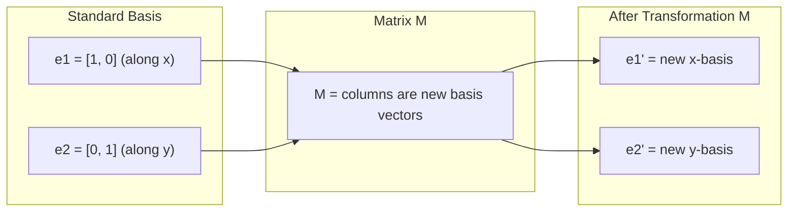
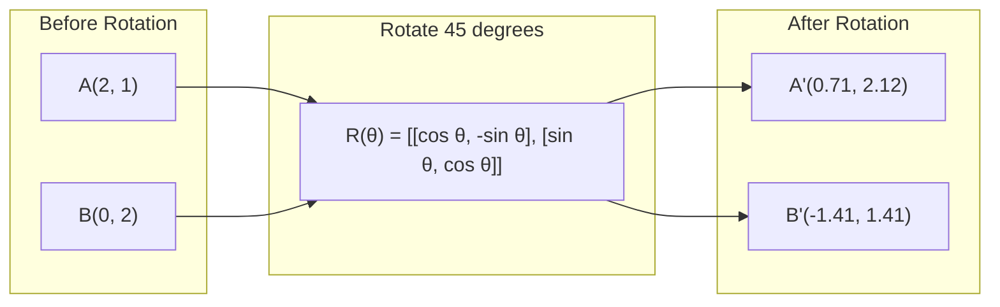
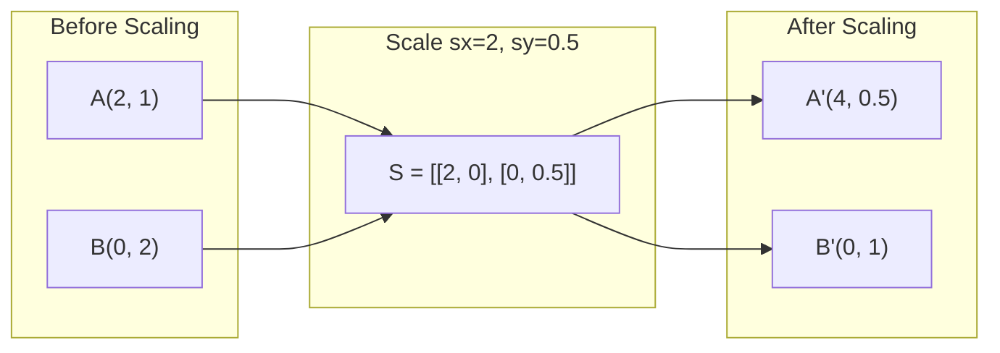
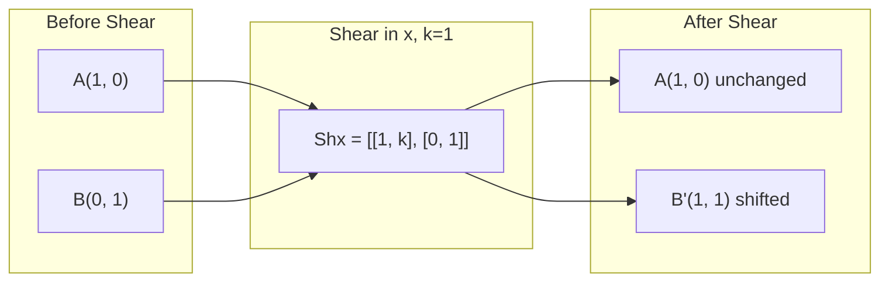
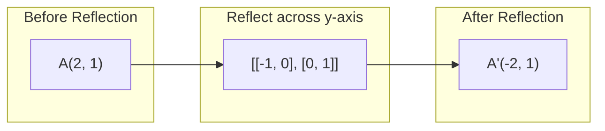
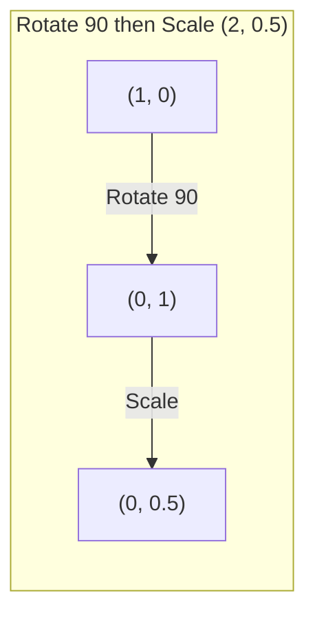
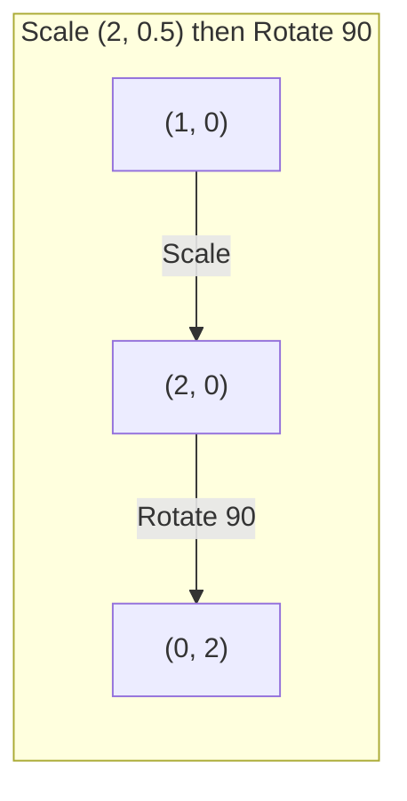

# 矩阵变换 (Matrix Transformations)

> 矩阵是一台重塑空间的机器。了解它对每个点的作用，你就能理解整个变换过程。

**类型：** 构建
**语言：** Python, Julia
**先修要求：** 第一阶段，第 01-02 课（线性代数直觉 (Linear Algebra Intuition)、向量与矩阵运算 (Vectors & Matrices Operations)）
**时长：** 约 75 分钟

## 学习目标

- 构建旋转矩阵 (Rotation Matrix)、缩放矩阵 (Scaling Matrix)、剪切矩阵 (Shearing Matrix) 和反射矩阵 (Reflection Matrix)，并将其应用于 2D 和 3D 点
- 通过矩阵乘法 (Matrix Multiplication) 组合多个变换，并验证变换顺序的重要性
- 根据特征方程 (Characteristic Equation) 计算 2x2 矩阵的特征值 (Eigenvalues) 和特征向量 (Eigenvectors)
- 解释为何特征值决定了主成分分析 (Principal Component Analysis, PCA) 的方向、循环神经网络 (Recurrent Neural Network, RNN) 的稳定性以及谱聚类 (Spectral Clustering) 的行为

## 问题

当你阅读关于主成分分析 (PCA) 的资料时，会看到“求协方差矩阵 (covariance matrix) 的特征向量 (eigenvectors)”。当你阅读关于模型稳定性 (model stability) 的内容时，会看到“检查所有特征值 (eigenvalues) 的模是否均小于 1”。当你阅读关于数据增强 (data augmentation) 的资料时，会看到“应用随机旋转”。除非你从几何角度理解矩阵 (matrices) 对空间的作用，否则这些内容都难以真正理解。

矩阵不仅仅是数字网格，它们是空间变换器 (spatial machines)。旋转矩阵 (rotation matrix) 使点发生旋转，缩放矩阵 (scaling matrix) 将其拉伸，剪切矩阵 (shearing matrix) 则使其倾斜。神经网络 (neural network) 对数据施加的每一次变换，都是这些操作之一或它们的组合。本课程将使这些操作变得具体可感。

## 概念

### Transformations as matrices

Every linear transformation in 2D can be written as a 2x2 matrix. The matrix tells you exactly where the basis vectors [1, 0] and [0, 1] end up. Everything else follows.



### Rotation

A 2D rotation by angle theta keeps distances and angles intact. It moves every point along a circular arc.



In 3D, you rotate around an axis. Each axis has its own rotation matrix:

```
Rz(theta) = | cos  -sin  0 |     Rotate around z-axis
            | sin   cos  0 |     (x-y plane spins, z stays)
            |  0     0   1 |

Rx(theta) = | 1   0     0    |   Rotate around x-axis
            | 0  cos  -sin   |   (y-z plane spins, x stays)
            | 0  sin   cos   |

Ry(theta) = |  cos  0  sin |     Rotate around y-axis
            |   0   1   0  |     (x-z plane spins, y stays)
            | -sin  0  cos |
```

### Scaling

Scaling stretches or compresses along each axis independently.



### Shearing

Shearing tilts one axis while keeping the other fixed. It turns rectangles into parallelograms.



Shear matrices:
- `Shx = [[1, k], [0, 1]]` shifts x by k * y
- `Shy = [[1, 0], [k, 1]]` shifts y by k * x

### Reflection

Reflection mirrors points across an axis or line.



Reflection matrices:
- Reflect across y-axis: `[[-1, 0], [0, 1]]`
- Reflect across x-axis: `[[1, 0], [0, -1]]`

### Composition: chaining transformations

Applying transformation A then B is the same as multiplying their matrices: `result = B @ A @ point`. Order matters. Rotate then scale gives different results than scale then rotate.



Composed: `S @ R = [[0, -2], [0.5, 0]]`



Composed: `R @ S = [[0, -0.5], [2, 0]]`

Different results. Matrix multiplication is not commutative.

### Eigenvalues and eigenvectors

Most vectors change direction when a matrix hits them. Eigenvectors are special: the matrix only scales them, never rotates them. The scaling factor is the eigenvalue.

```
A @ v = lambda * v

v is the eigenvector (direction that survives)
lambda is the eigenvalue (how much it stretches)

Example: A = | 2  1 |
             | 1  2 |

Eigenvector [1, 1] with eigenvalue 3:
  A @ [1,1] = [3, 3] = 3 * [1, 1]     (same direction, scaled by 3)

Eigenvector [1, -1] with eigenvalue 1:
  A @ [1,-1] = [1, -1] = 1 * [1, -1]  (same direction, unchanged)
```

The matrix stretches space by 3x along [1, 1] and keeps [1, -1] unchanged. Every other direction is a mix of these two.

### Eigendecomposition

If a matrix has n linearly independent eigenvectors, it can be decomposed:

```
A = V @ D @ V^(-1)

V = matrix whose columns are eigenvectors
D = diagonal matrix of eigenvalues
V^(-1) = inverse of V

This says: rotate into eigenvector coordinates, scale along each axis, rotate back.
```

### Why eigenvalues matter

**PCA.** The eigenvectors of the covariance matrix are the principal components. The eigenvalues tell you how much variance each component captures. Sort by eigenvalue, keep the top k, and you have dimensionality reduction.

**Stability.** In recurrent networks and dynamical systems, eigenvalues with magnitude > 1 cause outputs to explode. Magnitude < 1 causes them to vanish. This is the vanishing/exploding gradient problem stated in one sentence.

**Spectral methods.** Graph neural networks use eigenvalues of the adjacency matrix. Spectral clustering uses eigenvalues of the Laplacian. The eigenvectors reveal the structure of the graph.

### Determinant as volume scaling factor

The determinant of a transformation matrix tells you how much it scales area (2D) or volume (3D).

```
det = 1:   area preserved (rotation)
det = 2:   area doubled
det = 0:   space crushed to lower dimension (singular)
det = -1:  area preserved but orientation flipped (reflection)

| det(Rotation) | = 1        (always)
| det(Scale sx, sy) | = sx * sy
| det(Shear) | = 1           (area preserved)
| det(Reflection) | = -1     (orientation flipped)
```

## 开始构建

### 步骤 1：从零实现变换矩阵（Transformation matrices）（Python）

import math

def rotation_2d(theta):
    c, s = math.cos(theta), math.sin(theta)
    return [[c, -s], [s, c]]

def scaling_2d(sx, sy):
    return [[sx, 0], [0, sy]]

def shearing_2d(kx, ky):
    return [[1, kx], [ky, 1]]

def reflection_x():
    return [[1, 0], [0, -1]]

def reflection_y():
    return [[-1, 0], [0, 1]]

def mat_vec_mul(matrix, vector):
    return [
        sum(matrix[i][j] * vector[j] for j in range(len(vector)))
        for i in range(len(matrix))
    ]

def mat_mul(a, b):
    rows_a, cols_b = len(a), len(b[0])
    cols_a = len(a[0])
    return [
        [sum(a[i][k] * b[k][j] for k in range(cols_a)) for j in range(cols_b)]
        for i in range(rows_a)
    ]

point = [1.0, 0.0]
angle = math.pi / 4

rotated = mat_vec_mul(rotation_2d(angle), point)
print(f"Rotate (1,0) by 45 deg: ({rotated[0]:.4f}, {rotated[1]:.4f})")

scaled = mat_vec_mul(scaling_2d(2, 3), [1.0, 1.0])
print(f"Scale (1,1) by (2,3): ({scaled[0]:.1f}, {scaled[1]:.1f})")

sheared = mat_vec_mul(shearing_2d(1, 0), [1.0, 1.0])
print(f"Shear (1,1) kx=1: ({sheared[0]:.1f}, {sheared[1]:.1f})")

reflected = mat_vec_mul(reflection_y(), [2.0, 1.0])
print(f"Reflect (2,1) across y: ({reflected[0]:.1f}, {reflected[1]:.1f})")

### 步骤 2：变换的组合（Composition of transformations）

R = rotation_2d(math.pi / 2)
S = scaling_2d(2, 0.5)

rotate_then_scale = mat_mul(S, R)
scale_then_rotate = mat_mul(R, S)

point = [1.0, 0.0]
result1 = mat_vec_mul(rotate_then_scale, point)
result2 = mat_vec_mul(scale_then_rotate, point)

print(f"Rotate 90 then scale: ({result1[0]:.2f}, {result1[1]:.2f})")
print(f"Scale then rotate 90: ({result2[0]:.2f}, {result2[1]:.2f})")
print(f"Same? {result1 == result2}")

### 步骤 3：从零计算特征值（Eigenvalues）（2x2）

对于 2x2 矩阵 `[[a, b], [c, d]]`，特征值需通过求解特征方程（Characteristic equation）得出：`lambda^2 - (a+d)*lambda + (ad - bc) = 0`。

def eigenvalues_2x2(matrix):
    a, b = matrix[0]
    c, d = matrix[1]
    trace = a + d
    det = a * d - b * c
    discriminant = trace ** 2 - 4 * det
    if discriminant < 0:
        real = trace / 2
        imag = (-discriminant) ** 0.5 / 2
        return (complex(real, imag), complex(real, -imag))
    sqrt_disc = discriminant ** 0.5
    return ((trace + sqrt_disc) / 2, (trace - sqrt_disc) / 2)

def eigenvector_2x2(matrix, eigenvalue):
    a, b = matrix[0]
    c, d = matrix[1]
    if abs(b) > 1e-10:
        v = [b, eigenvalue - a]
    elif abs(c) > 1e-10:
        v = [eigenvalue - d, c]
    else:
        if abs(a - eigenvalue) < 1e-10:
            v = [1, 0]
        else:
            v = [0, 1]
    mag = (v[0] ** 2 + v[1] ** 2) ** 0.5
    return [v[0] / mag, v[1] / mag]

A = [[2, 1], [1, 2]]
vals = eigenvalues_2x2(A)
print(f"Matrix: {A}")
print(f"Eigenvalues: {vals[0]:.4f}, {vals[1]:.4f}")

for val in vals:
    vec = eigenvector_2x2(A, val)
    result = mat_vec_mul(A, vec)
    scaled = [val * vec[0], val * vec[1]]
    print(f"  lambda={val:.1f}, v={[round(x,4) for x in vec]}")
    print(f"    A@v = {[round(x,4) for x in result]}")
    print(f"    l*v = {[round(x,4) for x in scaled]}")

### 步骤 4：行列式（Determinant）作为体积缩放因子（Volume scaling factor）

def det_2x2(matrix):
    return matrix[0][0] * matrix[1][1] - matrix[0][1] * matrix[1][0]

print(f"det(rotation 45) = {det_2x2(rotation_2d(math.pi/4)):.4f}")
print(f"det(scale 2,3)   = {det_2x2(scaling_2d(2, 3)):.1f}")
print(f"det(shear kx=1)  = {det_2x2(shearing_2d(1, 0)):.1f}")
print(f"det(reflect y)   = {det_2x2(reflection_y()):.1f}")

singular = [[1, 2], [2, 4]]
print(f"det(singular)     = {det_2x2(singular):.1f}")
print("Singular: columns are proportional, space collapses to a line.")

奇异（Singular）：列向量成比例，空间坍缩为一条直线。

## 使用方法

NumPy 通过优化例程（optimized routines）处理所有这些操作。

import numpy as np

theta = np.pi / 4
R = np.array([[np.cos(theta), -np.sin(theta)],
              [np.sin(theta),  np.cos(theta)]])

point = np.array([1.0, 0.0])
print(f"Rotate (1,0) by 45 deg: {R @ point}")

S = np.diag([2.0, 3.0])
composed = S @ R
print(f"Scale(2,3) after Rotate(45): {composed @ point}")

A = np.array([[2, 1], [1, 2]], dtype=float)
eigenvalues, eigenvectors = np.linalg.eig(A)
print(f"\nEigenvalues: {eigenvalues}")
print(f"Eigenvectors (columns):\n{eigenvectors}")

for i in range(len(eigenvalues)):
    v = eigenvectors[:, i]
    lam = eigenvalues[i]
    print(f"  A @ v{i} = {A @ v}, lambda * v{i} = {lam * v}")

print(f"\ndet(R) = {np.linalg.det(R):.4f}")
print(f"det(S) = {np.linalg.det(S):.1f}")

B = np.array([[3, 1], [0, 2]], dtype=float)
vals, vecs = np.linalg.eig(B)
D = np.diag(vals)
V = vecs
reconstructed = V @ D @ np.linalg.inv(V)
print(f"\nEigendecomposition A = V @ D @ V^-1:")
print(f"Original:\n{B}")
print(f"Reconstructed:\n{reconstructed}")

### 使用 NumPy 进行三维旋转（3D rotations）

def rotation_3d_z(theta):
    c, s = np.cos(theta), np.sin(theta)
    return np.array([[c, -s, 0], [s, c, 0], [0, 0, 1]])

def rotation_3d_x(theta):
    c, s = np.cos(theta), np.sin(theta)
    return np.array([[1, 0, 0], [0, c, -s], [0, s, c]])

point_3d = np.array([1.0, 0.0, 0.0])
rotated_z = rotation_3d_z(np.pi / 2) @ point_3d
rotated_x = rotation_3d_x(np.pi / 2) @ point_3d

print(f"\n3D point: {point_3d}")
print(f"Rotate 90 around z: {np.round(rotated_z, 4)}")
print(f"Rotate 90 around x: {np.round(rotated_x, 4)}")


## 发布上线

本课程将为第二阶段的主成分分析 (Principal Component Analysis) 与神经网络权重分析奠定几何基础。此处构建的特征值/特征向量 (Eigenvalue/Eigenvector) 代码，正是驱动生产环境机器学习 (Machine Learning) 系统中降维 (Dimensionality Reduction)、谱聚类 (Spectral Clustering) 与稳定性分析 (Stability Analysis) 的核心算法。

## 练习

1. 对单位正方形 (unit square)（顶点 (corners) 位于 [0,0]、[1,0]、[1,1]、[0,1]）分别应用旋转 (rotation)、缩放 (scaling) 与剪切 (shearing) 变换。打印每种变换后的顶点坐标。验证旋转是否保持了各顶点间的距离。

2. 使用特征方程 (characteristic equation) 手动求解矩阵 (matrix) [[4, 2], [1, 3]] 的特征值 (eigenvalues)。随后使用你自行编写的函数以及 NumPy 进行验证。

3. 构建一个包含三种变换的组合 (composition)（旋转 30 度、按 [1.5, 0.8] 缩放、kx=0.3 的剪切），并将其作用于呈圆形排列的 8 个点。打印变换前后的坐标。计算组合矩阵的行列式 (determinant)，并验证其是否等于各独立变换矩阵行列式的乘积。

## 关键术语

| 术语 | 通俗说法 | 实际含义 |
|------|----------------|----------------------|
| 旋转矩阵 (Rotation matrix) | “让物体旋转” | 一种正交矩阵，使点沿圆弧移动，同时保持距离和角度不变。其行列式始终为 1。 |
| 缩放矩阵 (Scaling matrix) | “让物体变大” | 一种对角矩阵，沿各坐标轴独立进行拉伸或压缩。其行列式等于各缩放因子的乘积。 |
| 剪切矩阵 (Shearing matrix) | “让物体倾斜” | 一种使一个坐标按另一坐标的比例发生偏移的矩阵，可将矩形变为平行四边形。其行列式为 1。 |
| 反射 (Reflection) | “像镜子一样翻转物体” | 一种沿轴或平面翻转空间的矩阵。其行列式为 -1。 |
| 变换复合 (Composition) | “连续执行两次操作” | 将变换矩阵相乘以串联操作。顺序至关重要：B @ A 表示先应用 A，再应用 B。 |
| 特征向量 (Eigenvector) | “特殊方向” | 矩阵仅对其进行缩放而从不旋转的方向。可视为该变换的“指纹”。 |
| 特征值 (Eigenvalue) | “拉伸了多少” | 矩阵对其特征向量进行缩放的标量因子。可为负数（表示翻转）或复数（表示旋转）。 |
| 特征分解 (Eigendecomposition) | “把矩阵拆开” | 将矩阵表示为 V @ D @ V^(-1) 的形式，将其分解为基本的缩放方向与幅度。 |
| 行列式 (Determinant) | “从矩阵中算出的一个数” | 变换对面积（2D）或体积（3D）的缩放因子。若为零，则表示该变换不可逆。 |
| 特征方程 (Characteristic equation) | “特征值的来源” | det(A - lambda * I) = 0。其根即为特征值的多项式方程。 |

## 延伸阅读

- [3Blue1Brown: 线性变换 (Linear Transformations)](https://www.3blue1brown.com/lessons/linear-transformations) -- 直观展示矩阵 (Matrices) 如何重塑空间
- [3Blue1Brown: 特征向量与特征值 (Eigenvectors and Eigenvalues)](https://www.3blue1brown.com/lessons/eigenvalues) -- 对特征向量几何意义的最佳可视化解释
- [MIT 18.06 第 21 讲：特征值与特征向量](https://ocw.mit.edu/courses/18-06-linear-algebra-spring-2010/) -- 吉尔伯特·斯特朗的经典讲解