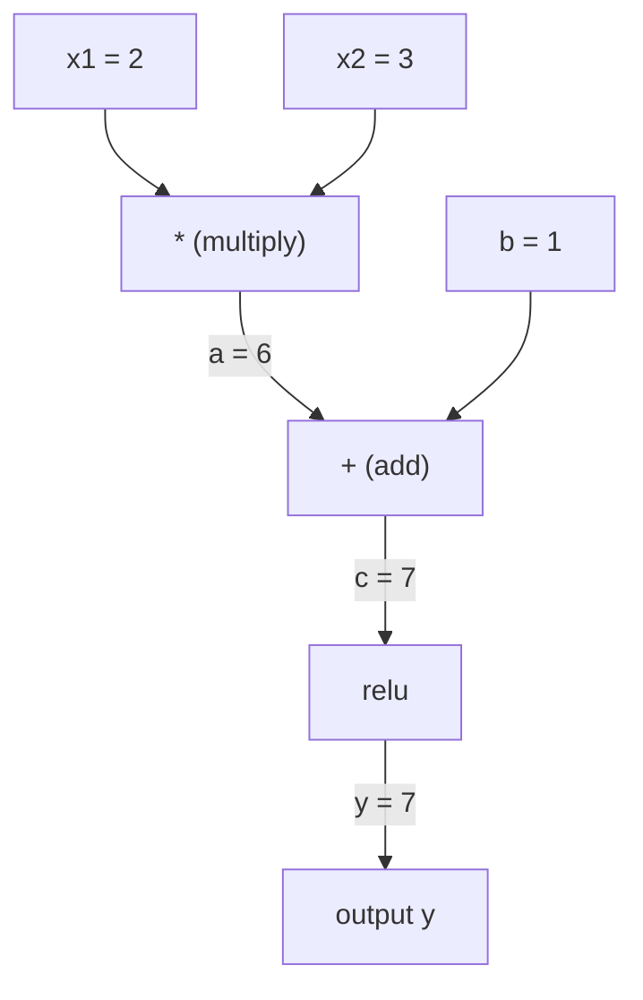
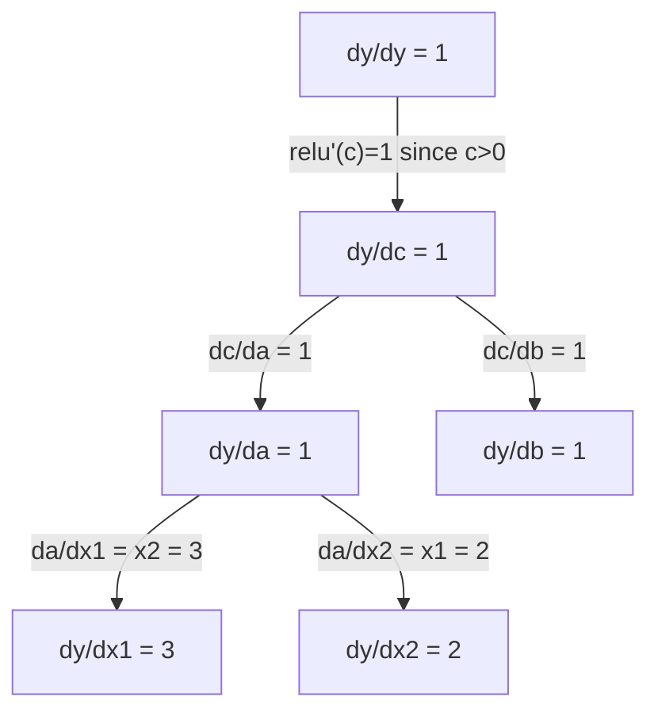

# 链式法则 (Chain Rule) 与自动微分 (Automatic Differentiation)

> 链式法则是每一个具备学习能力的神经网络 (Neural Network) 背后的核心引擎。

**类型：** 构建
**语言：** Python
**前置知识：** 第一阶段，第 04 课（导数 (Derivatives) 与梯度 (Gradients)）
**时长：** 约 90 分钟

## 学习目标

- 构建一个极简的自动微分引擎 (autograd engine)（基于 Value 类 (Value class)），用于记录运算操作并通过反向模式自动微分 (reverse-mode autodiff) 计算梯度
- 利用拓扑排序 (topological sort) 在计算图 (computation graph) 中实现前向传播与反向传播 (forward and backward passes)
- 仅使用从零构建的自动微分引擎，搭建并训练一个用于解决异或 (XOR) 问题的多层感知机 (multi-layer perceptron)
- 通过与数值有限差分法 (numerical finite differences) 进行对比的梯度检查 (gradient checking)，验证自动微分 (autodiff) 的正确性

## 问题

你可以计算简单函数的导数 (derivative)。但神经网络 (neural network) 并非简单的函数。它是由数百个函数组合而成的：矩阵乘法 (matrix multiplication)、添加偏置 (bias)、应用激活函数 (activation)、再次进行矩阵乘法、Softmax、交叉熵损失 (cross-entropy loss)。其输出实际上是函数的函数的函数。

为了训练网络，你需要计算损失相对于每一个权重 (weight) 的梯度 (gradient)。面对数百万个参数，手动计算是不可能的。使用数值方法（如有限差分法 (finite differences)）又太慢。

链式法则 (chain rule) 提供了数学基础。自动微分 (automatic differentiation) 提供了算法实现。两者结合，使你能够以与单次前向传播 (forward pass) 相当的时间，精确计算任意函数复合结构的梯度。

这正是 PyTorch、TensorFlow 和 JAX 的工作原理。你将从零开始构建一个精简版。

## 概念

### The Chain Rule

If `y = f(g(x))`, the derivative of `y` with respect to `x` is:

```
dy/dx = dy/dg * dg/dx = f'(g(x)) * g'(x)
```

Multiply the derivatives along the chain. Each link contributes its local derivative.

Example: `y = sin(x^2)`

```
g(x) = x^2       g'(x) = 2x
f(g) = sin(g)     f'(g) = cos(g)

dy/dx = cos(x^2) * 2x
```

For deeper compositions, the chain extends:

```
y = f(g(h(x)))

dy/dx = f'(g(h(x))) * g'(h(x)) * h'(x)
```

Every layer in a neural network is one link in this chain.

### Computational Graphs

A computational graph makes the chain rule visual. Every operation becomes a node. Data flows forward through the graph. Gradients flow backward.

**Forward pass (compute values):**



**Backward pass (compute gradients):**



The backward pass applies the chain rule at every node, propagating gradients from output to inputs.

### Forward Mode vs Reverse Mode

There are two ways to apply the chain rule through a graph.

**Forward mode** starts at the inputs and pushes derivatives forward. It computes `dx/dx = 1` and propagates through each operation. Good when you have few inputs and many outputs.

```
Forward mode: seed dx/dx = 1, propagate forward

  x = 2       (dx/dx = 1)
  a = x^2     (da/dx = 2x = 4)
  y = sin(a)  (dy/dx = cos(a) * da/dx = cos(4) * 4 = -2.615)
```

**Reverse mode** starts at the output and pulls gradients backward. It computes `dy/dy = 1` and propagates through each operation in reverse. Good when you have many inputs and few outputs.

```
Reverse mode: seed dy/dy = 1, propagate backward

  y = sin(a)  (dy/dy = 1)
  a = x^2     (dy/da = cos(a) = cos(4) = -0.654)
  x = 2       (dy/dx = dy/da * da/dx = -0.654 * 4 = -2.615)
```

Neural networks have millions of inputs (weights) and one output (loss). Reverse mode computes all gradients in one backward pass. This is why backpropagation uses reverse mode.

| Mode | Seed | Direction | Best when |
|------|------|-----------|-----------|
| Forward | `dx_i/dx_i = 1` | Input to output | Few inputs, many outputs |
| Reverse | `dy/dy = 1` | Output to input | Many inputs, few outputs (neural nets) |

### Dual Numbers for Forward Mode

Forward mode can be implemented elegantly with dual numbers. A dual number has the form `a + b*epsilon` where `epsilon^2 = 0`.

```
Dual number: (value, derivative)

(2, 1) means: value is 2, derivative w.r.t. x is 1

Arithmetic rules:
  (a, a') + (b, b') = (a+b, a'+b')
  (a, a') * (b, b') = (a*b, a'*b + a*b')
  sin(a, a')         = (sin(a), cos(a)*a')
```

Seed the input variable with derivative 1. The derivative propagates automatically through every operation.

### Building an Autograd Engine

An autograd engine needs three things:

1. **Value wrapping.** Wrap every number in an object that stores its value and gradient.
2. **Graph recording.** Every operation records its inputs and the local gradient function.
3. **Backward pass.** Topological sort the graph, then walk it in reverse, applying the chain rule at each node.

This is exactly what PyTorch's `autograd` does. The `torch.Tensor` class wraps values, records operations when `requires_grad=True`, and computes gradients when you call `.backward()`.

### How PyTorch Autograd Works Under the Hood

When you write PyTorch code:

```python
x = torch.tensor(2.0, requires_grad=True)
y = x ** 2 + 3 * x + 1
y.backward()
print(x.grad)  # 7.0 = 2*x + 3 = 2*2 + 3
```

PyTorch internally:

1. Creates a `Tensor` node for `x` with `requires_grad=True`
2. Every operation (`**`, `*`, `+`) creates a new node and records the backward function
3. `y.backward()` triggers reverse-mode autodiff through the recorded graph
4. Each node's `grad_fn` computes local gradients and passes them to parent nodes
5. Gradients accumulate in `.grad` attributes via addition (not replacement)

The graph is dynamic (define-by-run). A new graph is built on every forward pass. This is why PyTorch supports control flow (if/else, loops) inside models.

## 构建它

### Step 1: The Value class

```python
class Value:
    def __init__(self, data, children=(), op=''):
        self.data = data
        self.grad = 0.0
        self._backward = lambda: None
        self._prev = set(children)
        self._op = op

    def __repr__(self):
        return f"Value(data={self.data:.4f}, grad={self.grad:.4f})"
```

Every `Value` stores its numeric data, its gradient (initially zero), a backward function, and pointers to child nodes that produced it.

### Step 2: Arithmetic operations with gradient tracking

```python
    def __add__(self, other):
        other = other if isinstance(other, Value) else Value(other)
        out = Value(self.data + other.data, (self, other), '+')
        def _backward():
            self.grad += out.grad
            other.grad += out.grad
        out._backward = _backward
        return out

    def __mul__(self, other):
        other = other if isinstance(other, Value) else Value(other)
        out = Value(self.data * other.data, (self, other), '*')
        def _backward():
            self.grad += other.data * out.grad
            other.grad += self.data * out.grad
        out._backward = _backward
        return out

    def relu(self):
        out = Value(max(0, self.data), (self,), 'relu')
        def _backward():
            self.grad += (1.0 if out.data > 0 else 0.0) * out.grad
        out._backward = _backward
        return out
```

Each operation creates a closure that knows how to compute local gradients and multiply by the upstream gradient (`out.grad`). The `+=` handles the case where a value is used in multiple operations.

### Step 3: The backward pass

```python
    def backward(self):
        topo = []
        visited = set()
        def build_topo(v):
            if v not in visited:
                visited.add(v)
                for child in v._prev:
                    build_topo(child)
                topo.append(v)
        build_topo(self)

        self.grad = 1.0
        for v in reversed(topo):
            v._backward()
```

Topological sort ensures every node's gradient is fully computed before it propagates to its children. The seed gradient is 1.0 (dy/dy = 1).

### Step 4: More operations for a complete engine

The basic Value class handles addition, multiplication, and relu. A real autograd engine needs more. Here are the operations you need to build neural networks:

```python
    def __neg__(self):
        return self * -1

    def __sub__(self, other):
        return self + (-other)

    def __radd__(self, other):
        return self + other

    def __rmul__(self, other):
        return self * other

    def __rsub__(self, other):
        return other + (-self)

    def __pow__(self, n):
        out = Value(self.data ** n, (self,), f'**{n}')
        def _backward():
            self.grad += n * (self.data ** (n - 1)) * out.grad
        out._backward = _backward
        return out

    def __truediv__(self, other):
        return self * (other ** -1) if isinstance(other, Value) else self * (Value(other) ** -1)

    def exp(self):
        import math
        e = math.exp(self.data)
        out = Value(e, (self,), 'exp')
        def _backward():
            self.grad += e * out.grad
        out._backward = _backward
        return out

    def log(self):
        import math
        out = Value(math.log(self.data), (self,), 'log')
        def _backward():
            self.grad += (1.0 / self.data) * out.grad
        out._backward = _backward
        return out

    def tanh(self):
        import math
        t = math.tanh(self.data)
        out = Value(t, (self,), 'tanh')
        def _backward():
            self.grad += (1 - t ** 2) * out.grad
        out._backward = _backward
        return out
```

**Why each operation matters:**

| Operation | Backward rule | Used in |
|-----------|--------------|---------|
| `__sub__` | Reuses add + neg | Loss computation (pred - target) |
| `__pow__` | n * x^(n-1) | Polynomial activations, MSE (error^2) |
| `__truediv__` | Reuses mul + pow(-1) | Normalization, learning rate scaling |
| `exp` | exp(x) * upstream | Softmax, log-likelihood |
| `log` | (1/x) * upstream | Cross-entropy loss, log probabilities |
| `tanh` | (1 - tanh^2) * upstream | Classic activation function |

The clever part: `__sub__` and `__truediv__` are defined in terms of existing operations. They get correct gradients for free because the chain rule composes through the underlying add/mul/pow operations.

### Step 5: Mini MLP from scratch

With a complete Value class, you can build a neural network. No PyTorch. No NumPy. Just Values and the chain rule.

```python
import random

class Neuron:
    def __init__(self, n_inputs):
        self.w = [Value(random.uniform(-1, 1)) for _ in range(n_inputs)]
        self.b = Value(0.0)

    def __call__(self, x):
        act = sum((wi * xi for wi, xi in zip(self.w, x)), self.b)
        return act.tanh()

    def parameters(self):
        return self.w + [self.b]

class Layer:
    def __init__(self, n_inputs, n_outputs):
        self.neurons = [Neuron(n_inputs) for _ in range(n_outputs)]

    def __call__(self, x):
        return [n(x) for n in self.neurons]

    def parameters(self):
        return [p for n in self.neurons for p in n.parameters()]

class MLP:
    def __init__(self, sizes):
        self.layers = [Layer(sizes[i], sizes[i+1]) for i in range(len(sizes)-1)]

    def __call__(self, x):
        for layer in self.layers:
            x = layer(x)
        return x[0] if len(x) == 1 else x

    def parameters(self):
        return [p for layer in self.layers for p in layer.parameters()]
```

A `Neuron` computes `tanh(w1*x1 + w2*x2 + ... + b)`. A `Layer` is a list of neurons. An `MLP` stacks layers. Every weight is a `Value`, so calling `loss.backward()` propagates gradients to every parameter.

**Training on XOR:**

```python
random.seed(42)
model = MLP([2, 4, 1])  # 2 inputs, 4 hidden neurons, 1 output

xs = [[0, 0], [0, 1], [1, 0], [1, 1]]
ys = [-1, 1, 1, -1]  # XOR pattern (using -1/1 for tanh)

for step in range(100):
    preds = [model(x) for x in xs]
    loss = sum((p - y) ** 2 for p, y in zip(preds, ys))

    for p in model.parameters():
        p.grad = 0.0
    loss.backward()

    lr = 0.05
    for p in model.parameters():
        p.data -= lr * p.grad

    if step % 20 == 0:
        print(f"step {step:3d}  loss = {loss.data:.4f}")

print("\nPredictions after training:")
for x, y in zip(xs, ys):
    print(f"  input={x}  target={y:2d}  pred={model(x).data:6.3f}")
```

This is micrograd. A complete neural network training loop in pure Python with automatic differentiation. Every commercial deep learning framework does the same thing at massive scale.

### Step 6: Gradient checking

How do you know your autodiff is correct? Compare it against numerical derivatives. This is gradient checking.

```python
def gradient_check(build_expr, x_val, h=1e-7):
    x = Value(x_val)
    y = build_expr(x)
    y.backward()
    autodiff_grad = x.grad

    y_plus = build_expr(Value(x_val + h)).data
    y_minus = build_expr(Value(x_val - h)).data
    numerical_grad = (y_plus - y_minus) / (2 * h)

    diff = abs(autodiff_grad - numerical_grad)
    return autodiff_grad, numerical_grad, diff
```

Test it on a complex expression:

```python
def expr(x):
    return (x ** 3 + x * 2 + 1).tanh()

ad, num, diff = gradient_check(expr, 0.5)
print(f"Autodiff:  {ad:.8f}")
print(f"Numerical: {num:.8f}")
print(f"Difference: {diff:.2e}")
# Difference should be < 1e-5
```

Gradient checking is essential when implementing new operations. If your backward pass has a bug, the numerical check catches it. Every serious deep learning implementation runs gradient checks during development.

**When to use gradient checking:**

| Situation | Do gradient check? |
|-----------|-------------------|
| Adding a new operation to your autograd | Yes, always |
| Debugging a training loop that won't converge | Yes, check gradients first |
| Production training | No, too slow (2x forward passes per parameter) |
| Unit tests for autograd code | Yes, automate it |

### Step 7: Verify against manual calculation

```python
x1 = Value(2.0)
x2 = Value(3.0)
a = x1 * x2          # a = 6.0
b = a + Value(1.0)    # b = 7.0
y = b.relu()          # y = 7.0

y.backward()

print(f"y = {y.data}")          # 7.0
print(f"dy/dx1 = {x1.grad}")   # 3.0 (= x2)
print(f"dy/dx2 = {x2.grad}")   # 2.0 (= x1)
```

Manual check: `y = relu(x1*x2 + 1)`. Since `x1*x2 + 1 = 7 > 0`, relu is identity.
`dy/dx1 = x2 = 3`. `dy/dx2 = x1 = 2`. The engine matches.

## 使用方法

### 与 PyTorch 进行验证

import torch

x1 = torch.tensor(2.0, requires_grad=True)
x2 = torch.tensor(3.0, requires_grad=True)
a = x1 * x2
b = a + 1.0
y = torch.relu(b)
y.backward()

print(f"PyTorch dy/dx1 = {x1.grad.item()}")  # 3.0
print(f"PyTorch dy/dx2 = {x2.grad.item()}")  # 2.0

梯度 (gradients) 完全一致。你的引擎计算出的结果与 PyTorch 相同，因为底层数学原理一致：基于链式法则 (chain rule) 的反向模式自动微分 (reverse-mode autodiff)。

### 更复杂的表达式

a = Value(2.0)
b = Value(-3.0)
c = Value(10.0)
f = (a * b + c).relu()  # relu(2*(-3) + 10) = relu(4) = 4

f.backward()
print(f"df/da = {a.grad}")  # -3.0 (= b)
print(f"df/db = {b.grad}")  #  2.0 (= a)
print(f"df/dc = {c.grad}")  #  1.0


## 发布

本课程将生成以下内容：
- `outputs/skill-autodiff.md` -- 用于构建和调试自动微分系统 (autograd systems) 的技能指南
- `code/autodiff.py` -- 一个可供扩展的最小化自动微分引擎 (autograd engine)

此处构建的 Value 类 (Value class) 是第三阶段 (Phase 3) 神经网络训练循环 (neural network training loop) 的基础。

## 练习

1. 在 `Value` 类中添加 `__pow__` 方法，以便计算 `x ** n`。验证当 `x=2` 时，`d/dx(x^3)` 的值等于 `12.0`。

2. 将 `tanh` 添加为激活函数（Activation Function）。验证 `tanh'(0) = 1` 且 `tanh'(2) = 0.0707`（近似值）。

3. 为单个神经元（Neuron）构建计算图（Computation Graph）：`y = relu(w1*x1 + w2*x2 + b)`。计算全部五个梯度（Gradient），并与 PyTorch 的结果进行对比验证。

4. 使用对偶数（Dual Numbers）实现前向模式自动微分（Forward-mode Autodiff）。创建一个 `Dual` 类，并验证其计算出的导数（Derivative）与你的反向模式引擎（Reverse-mode Engine）结果一致。

## 关键术语

| 术语 | 通俗说法 | 实际含义 |
|------|----------------|----------------------|
| 链式法则 (Chain Rule) | “将导数相乘” | 复合函数的导数等于各函数局部导数的乘积，且需在正确的点处进行求值 |
| 计算图 (Computational Graph) | “网络结构图” | 一种有向无环图，其中节点表示运算操作，边负责传递数值（前向传播）或梯度（反向传播） |
| 前向模式 (Forward Mode) | “向前推进导数” | 一种自动微分方法，将导数从输入传播至输出。每个输入变量需进行一次前向遍历。 |
| 反向模式 (Reverse Mode) | “反向传播” | 一种自动微分方法，将梯度从输出传播至输入。每个输出变量需进行一次反向遍历。 |
| 自动梯度 (Autograd) | “自动计算梯度” | 一种记录数值运算操作、构建计算图，并通过链式法则精确计算梯度的系统 |
| 对偶数 (Dual Numbers) | “数值加导数” | 形式为 a + b*epsilon（epsilon^2 = 0）的数，能够在算术运算过程中携带导数信息 |
| 拓扑排序 (Topological Sort) | “依赖顺序” | 对图节点进行排序，确保每个节点都排在其所有依赖项之后。这是正确传播梯度的必要条件。 |
| 梯度累加 (Gradient Accumulation) | “累加而非覆盖” | 当一个值作为多个操作的输入时，其梯度等于所有传入梯度贡献的总和 |
| 动态图 (Dynamic Graph) | “运行时定义” | 在每次前向传播时重新构建的计算图，允许在模型内部使用 Python 控制流（PyTorch 风格） |
| 梯度检查 (Gradient Checking) | “数值验证” | 将自动微分计算的梯度与数值有限差分法计算的梯度进行对比，以验证正确性。对调试至关重要。 |
| 多层感知机 (MLP) | “多层感知器” | 包含一层或多层隐藏层神经元的神经网络。每个神经元先计算加权求和与偏置，再应用激活函数。 |
| 神经元 (Neuron) | “加权求和 + 激活” | 神经网络的基本单元：输出 = 激活函数(w1*x1 + w2*x2 + ... + b)。其中的权重和偏置均为可学习参数。 |

## 延伸阅读

- [3Blue1Brown：反向传播微积分（Backpropagation Calculus）](https://www.youtube.com/watch?v=tIeHLnjs5U8) -- 神经网络（Neural Networks）中链式法则（Chain Rule）的可视化解释
- [PyTorch 自动微分机制（Autograd Mechanics）](https://pytorch.org/docs/stable/notes/autograd.html) -- 实际系统的工作原理
- [Baydin 等人，《机器学习（Machine Learning）中的自动微分（Automatic Differentiation）：综述》](https://arxiv.org/abs/1502.05767) -- 全面的参考资料