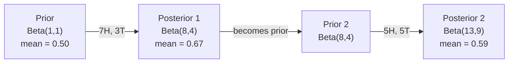

# 贝叶斯定理 (Bayes' Theorem)

> 概率 (Probability) 关乎你的预期，贝叶斯定理关乎你的所学。

**类型：** 构建 (Build)
**语言：** Python
**前置要求：** 第一阶段，第 06 课（概率论基础 (Probability Fundamentals)）
**时长：** 约 75 分钟

## 学习目标

- 应用贝叶斯定理（Bayes' theorem），结合先验（priors）、似然（likelihoods）与证据（evidence）计算后验概率（posterior probabilities）
- 从零开始构建朴素贝叶斯文本分类器（Naive Bayes text classifier），并实现拉普拉斯平滑（Laplace smoothing）与对数空间计算（log-space computation）
- 对比最大似然估计（Maximum Likelihood Estimation, MLE）与最大后验估计（Maximum A Posteriori, MAP），并阐明 MAP 如何对应 L2 正则化（L2 regularization）
- 针对 A/B 测试（A/B testing），利用 Beta-二项共轭先验（Beta-Binomial conjugate priors）实现序列贝叶斯更新（sequential Bayesian updating）

## 问题

某项医学检测的准确率为 99%。你的检测结果呈阳性。你实际患病的概率有多大？

大多数人会回答 99%。但真正的答案取决于该疾病的罕见程度。如果每 10,000 人中仅有 1 人患病，那么阳性结果实际上只意味着你患病的可能性约为 1%。其余 99% 的阳性结果均来自健康人群的误报 (false alarm)。

这并非脑筋急转弯，而是贝叶斯定理 (Bayes' theorem)。每一款垃圾邮件过滤器、每一项医学诊断工具，以及每一个用于量化不确定性 (quantify uncertainty) 的机器学习模型 (machine learning model)，都严格遵循这一推理逻辑。你从一个初始信念出发，观察到证据，随后进行更新。

如果在构建机器学习系统时缺乏对此的理解，你将误读模型输出、设定错误的阈值 (thresholds)，并发布过度自信的预测结果。

## 概念

### From joint probability to Bayes

You already know from Lesson 06 that conditional probability is:

```
P(A|B) = P(A and B) / P(B)
```

And symmetrically:

```
P(B|A) = P(A and B) / P(A)
```

Both expressions share the same numerator: P(A and B). Set them equal and rearrange:

```
P(A and B) = P(A|B) * P(B) = P(B|A) * P(A)

Therefore:

P(A|B) = P(B|A) * P(A) / P(B)
```

That is Bayes' theorem. Four quantities, one equation.

### The four parts

| Part | Name | What it means |
|------|------|---------------|
| P(A\|B) | Posterior | Your updated belief about A after seeing evidence B |
| P(B\|A) | Likelihood | How probable the evidence B is if A is true |
| P(A) | Prior | Your belief about A before seeing any evidence |
| P(B) | Evidence | Total probability of seeing B under all possibilities |

The evidence term P(B) acts as a normalizer. You can expand it using the law of total probability:

```
P(B) = P(B|A) * P(A) + P(B|not A) * P(not A)
```

### Medical test example

A disease affects 1 in 10,000 people. The test is 99% accurate (catches 99% of sick people, gives false positives 1% of the time).

```
P(sick)          = 0.0001     (prior: disease is rare)
P(positive|sick) = 0.99       (likelihood: test catches it)
P(positive|healthy) = 0.01    (false positive rate)

P(positive) = P(positive|sick) * P(sick) + P(positive|healthy) * P(healthy)
            = 0.99 * 0.0001 + 0.01 * 0.9999
            = 0.000099 + 0.009999
            = 0.010098

P(sick|positive) = P(positive|sick) * P(sick) / P(positive)
                 = 0.99 * 0.0001 / 0.010098
                 = 0.0098
                 = 0.98%
```

Less than 1%. The prior dominates. When a condition is rare, even accurate tests produce mostly false positives. This is why doctors order confirmation tests.

### Spam filter example

You receive an email containing the word "lottery". Is it spam?

```
P(spam)                = 0.3      (30% of email is spam)
P("lottery"|spam)      = 0.05     (5% of spam emails contain "lottery")
P("lottery"|not spam)  = 0.001    (0.1% of legitimate emails contain "lottery")

P("lottery") = 0.05 * 0.3 + 0.001 * 0.7
             = 0.015 + 0.0007
             = 0.0157

P(spam|"lottery") = 0.05 * 0.3 / 0.0157
                  = 0.955
                  = 95.5%
```

One word shifts the probability from 30% to 95.5%. A real spam filter applies Bayes across hundreds of words simultaneously.

### Naive Bayes: independence assumption

Naive Bayes extends this to multiple features by assuming all features are conditionally independent given the class:

```
P(class | feature_1, feature_2, ..., feature_n)
  = P(class) * P(feature_1|class) * P(feature_2|class) * ... * P(feature_n|class)
    / P(feature_1, feature_2, ..., feature_n)
```

The "naive" part is the independence assumption. In text, word occurrences are not independent ("New" and "York" are correlated). But the assumption works surprisingly well in practice because the classifier only needs to rank classes, not produce calibrated probabilities.

Since the denominator is the same for all classes, you can skip it and just compare numerators:

```
score(class) = P(class) * product of P(feature_i | class)
```

Pick the class with the highest score.

### Maximum likelihood estimation (MLE)

How do you get P(feature|class) from training data? Count.

```
P("free"|spam) = (number of spam emails containing "free") / (total spam emails)
```

This is MLE: choose the parameter values that make the observed data most likely. You are maximizing the likelihood function, which for discrete counts reduces to relative frequency.

Problem: if a word never appears in spam during training, MLE gives it probability zero. One unseen word kills the entire product. Fix this with Laplace smoothing:

```
P(word|class) = (count(word, class) + 1) / (total_words_in_class + vocabulary_size)
```

Adding 1 to every count ensures no probability is ever zero.

### Maximum a posteriori (MAP)

MLE asks: what parameters maximize P(data|parameters)?

MAP asks: what parameters maximize P(parameters|data)?

By Bayes' theorem:

```
P(parameters|data) proportional to P(data|parameters) * P(parameters)
```

MAP adds a prior over the parameters themselves. If you believe parameters should be small, you encode that as a prior that penalizes large values. This is identical to L2 regularization in ML. The "ridge" penalty in ridge regression is literally a Gaussian prior on the weights.

| Estimation | Optimizes | ML equivalent |
|------------|-----------|---------------|
| MLE | P(data\|params) | Unregularized training |
| MAP | P(data\|params) * P(params) | L2 / L1 regularization |

### Bayesian vs frequentist: the practical difference

Frequentists treat parameters as fixed unknowns. They ask: "If I repeated this experiment many times, what would happen?"

Bayesians treat parameters as distributions. They ask: "Given what I have observed, what do I believe about the parameters?"

For building ML systems, the practical difference:

| Aspect | Frequentist | Bayesian |
|--------|-------------|----------|
| Output | Point estimate | Distribution over values |
| Uncertainty | Confidence intervals (about procedure) | Credible intervals (about parameter) |
| Small data | Can overfit | Prior acts as regularization |
| Computation | Usually faster | Often requires sampling (MCMC) |

Most production ML is frequentist (SGD, point estimates). Bayesian methods shine when you need calibrated uncertainty (medical decisions, safety-critical systems) or when data is scarce (few-shot learning, cold start).

### Why Bayesian thinking matters for ML

The connection is deeper than analogy:

**Priors are regularization.** A Gaussian prior on weights is L2 regularization. A Laplace prior is L1. Every time you add a regularization term, you are making a Bayesian statement about what parameter values you expect.

**Posteriors are uncertainty.** A single predicted probability tells you nothing about how confident the model is in that estimate. Bayesian methods give you a distribution: "I think P(spam) is between 0.8 and 0.95."

**Bayes updates are online learning.** Today's posterior becomes tomorrow's prior. When your model sees new data, it updates its beliefs incrementally instead of retraining from scratch.

**Model comparison is Bayesian.** Bayesian information criterion (BIC), marginal likelihood, and Bayes factors all use Bayesian reasoning to choose between models without overfitting.

## 构建它

### 步骤 1：贝叶斯定理 (Bayes theorem) 函数

def bayes(prior, likelihood, false_positive_rate):
    evidence = likelihood * prior + false_positive_rate * (1 - prior)
    posterior = likelihood * prior / evidence
    return posterior

result = bayes(prior=0.0001, likelihood=0.99, false_positive_rate=0.01)
print(f"P(sick|positive) = {result:.4f}")

### 步骤 2：朴素贝叶斯分类器 (Naive Bayes classifier)

import math
from collections import defaultdict

class NaiveBayes:
    def __init__(self, smoothing=1.0):
        self.smoothing = smoothing
        self.class_counts = defaultdict(int)
        self.word_counts = defaultdict(lambda: defaultdict(int))
        self.class_word_totals = defaultdict(int)
        self.vocab = set()

    def train(self, documents, labels):
        for doc, label in zip(documents, labels):
            self.class_counts[label] += 1
            words = doc.lower().split()
            for word in words:
                self.word_counts[label][word] += 1
                self.class_word_totals[label] += 1
                self.vocab.add(word)

    def predict(self, document):
        words = document.lower().split()
        total_docs = sum(self.class_counts.values())
        vocab_size = len(self.vocab)
        best_class = None
        best_score = float("-inf")
        for cls in self.class_counts:
            score = math.log(self.class_counts[cls] / total_docs)
            for word in words:
                count = self.word_counts[cls].get(word, 0)
                total = self.class_word_totals[cls]
                score += math.log((count + self.smoothing) / (total + self.smoothing * vocab_size))
            if score > best_score:
                best_score = score
                best_class = cls
        return best_class

对数概率 (Log probabilities) 可防止下溢 (underflow)。将多个极小的概率相乘会产生浮点数 (floating point) 无法表示的极小数值。对对数概率求和不仅在数学上等价，而且在数值计算上更加稳定。

### 步骤 3：在垃圾邮件数据上进行训练

train_docs = [
    "win free money now",
    "free lottery ticket winner",
    "claim your prize today free",
    "urgent offer free cash",
    "congratulations you won free",
    "meeting tomorrow at noon",
    "project update attached",
    "can we schedule a call",
    "quarterly report review",
    "lunch on thursday sounds good",
    "team standup notes attached",
    "please review the pull request",
]

train_labels = [
    "spam", "spam", "spam", "spam", "spam",
    "ham", "ham", "ham", "ham", "ham", "ham", "ham",
]

classifier = NaiveBayes()
classifier.train(train_docs, train_labels)

test_messages = [
    "free money waiting for you",
    "meeting rescheduled to friday",
    "you won a free prize",
    "please review the attached report",
]

for msg in test_messages:
    print(f"  '{msg}' -> {classifier.predict(msg)}")

### 步骤 4：检查学习到的概率

def show_top_words(classifier, cls, n=5):
    vocab_size = len(classifier.vocab)
    total = classifier.class_word_totals[cls]
    probs = {}
    for word in classifier.vocab:
        count = classifier.word_counts[cls].get(word, 0)
        probs[word] = (count + classifier.smoothing) / (total + classifier.smoothing * vocab_size)
    sorted_words = sorted(probs.items(), key=lambda x: x[1], reverse=True)
    for word, prob in sorted_words[:n]:
        print(f"    {word}: {prob:.4f}")

print("\nTop spam words:")
show_top_words(classifier, "spam")
print("\nTop ham words:")
show_top_words(classifier, "ham")


## 使用方法

Scikit-learn 提供了生产就绪（Production-ready）的朴素贝叶斯（Naive Bayes）实现：

from sklearn.feature_extraction.text import CountVectorizer
from sklearn.naive_bayes import MultinomialNB
from sklearn.metrics import classification_report

vectorizer = CountVectorizer()
X_train = vectorizer.fit_transform(train_docs)
clf = MultinomialNB()
clf.fit(X_train, train_labels)

X_test = vectorizer.transform(test_messages)
predictions = clf.predict(X_test)
for msg, pred in zip(test_messages, predictions):
    print(f"  '{msg}' -> {pred}")

底层算法完全相同。CountVectorizer 负责处理分词（Tokenization）与词汇表构建（Vocabulary Building），而 MultinomialNB 则在内部处理平滑（Smoothing）与对数概率（Log-probabilities）计算。你从零实现的版本仅用 40 行代码便完成了相同的工作。

## 发布

The NaiveBayes class built here demonstrates the full pipeline: tokenization, probability estimation with Laplace smoothing, log-space prediction. The code in `code/bayes.py` runs end-to-end with no dependencies beyond Python's standard library.

### Conjugate Priors

When the prior and posterior belong to the same family of distributions, the prior is called "conjugate." This makes Bayesian updating algebraically clean -- you get a closed-form posterior without numerical integration.

| Likelihood | Conjugate Prior | Posterior | Example |
|-----------|----------------|-----------|---------|
| Bernoulli | Beta(a, b) | Beta(a + successes, b + failures) | Coin flip bias estimation |
| Normal (known variance) | Normal(mu_0, sigma_0) | Normal(weighted mean, smaller variance) | Sensor calibration |
| Poisson | Gamma(a, b) | Gamma(a + sum of counts, b + n) | Modeling arrival rates |
| Multinomial | Dirichlet(alpha) | Dirichlet(alpha + counts) | Topic modeling, language models |

Why this matters: without conjugate priors, you need Monte Carlo sampling or variational inference to approximate the posterior. With conjugate priors, you just update two numbers.

The Beta distribution is the most common conjugate prior in practice. Beta(a, b) represents your belief about a probability parameter. The mean is a/(a+b). The larger a+b, the more concentrated (confident) the distribution.

Special cases of the Beta prior:
- Beta(1, 1) = uniform. You have no opinion about the parameter.
- Beta(10, 10) = peaked at 0.5. You strongly believe the parameter is near 0.5.
- Beta(1, 10) = skewed toward 0. You believe the parameter is small.

The update rule is dead simple:

```
Prior:     Beta(a, b)
Data:      s successes, f failures
Posterior: Beta(a + s, b + f)
```

No integrals. No sampling. Just addition.

### Sequential Bayesian Updating

Bayesian inference is naturally sequential. Today's posterior becomes tomorrow's prior. This is how real systems learn incrementally without reprocessing all historical data.

Concrete example: estimating whether a coin is fair.

**Day 1: No data yet.**
Start with Beta(1, 1) -- a uniform prior. You have no opinion.
- Prior mean: 0.5
- Prior is flat across [0, 1]

**Day 2: Observe 7 heads, 3 tails.**
Posterior = Beta(1 + 7, 1 + 3) = Beta(8, 4)
- Posterior mean: 8/12 = 0.667
- Evidence suggests the coin is biased toward heads

**Day 3: Observe 5 more heads, 5 more tails.**
Use yesterday's posterior as today's prior.
Posterior = Beta(8 + 5, 4 + 5) = Beta(13, 9)
- Posterior mean: 13/22 = 0.591
- The balanced new data pulled the estimate back toward 0.5



The order of observations does not matter. Beta(1,1) updated with all 12 heads and 8 tails at once gives Beta(13, 9) -- the same result. Sequential updating and batch updating are mathematically equivalent. But sequential updating lets you make decisions at each step without storing raw data.

This is the foundation of online learning in production ML systems. Thompson sampling for bandits, incremental recommendation systems, and streaming anomaly detectors all use this pattern.

### Connection to A/B Testing

A/B testing is Bayesian inference in disguise.

Setup: you are testing two button colors. Variant A (blue) and variant B (green). You want to know which one gets more clicks.

The Bayesian A/B test:

1. **Prior.** Start with Beta(1, 1) for both variants. No prior preference.
2. **Data.** Variant A: 50 clicks out of 1000 views. Variant B: 65 clicks out of 1000 views.
3. **Posteriors.**
   - A: Beta(1 + 50, 1 + 950) = Beta(51, 951). Mean = 0.051
   - B: Beta(1 + 65, 1 + 935) = Beta(66, 936). Mean = 0.066
4. **Decision.** Compute P(B > A) -- the probability that B's true conversion rate is higher than A's.

Computing P(B > A) analytically is hard. But Monte Carlo makes it trivial:

```
1. Draw 100,000 samples from Beta(51, 951)  -> samples_A
2. Draw 100,000 samples from Beta(66, 936)  -> samples_B
3. P(B > A) = fraction of samples where B > A
```

If P(B > A) > 0.95, you ship variant B. If it is between 0.05 and 0.95, you keep collecting data. If P(B > A) < 0.05, you ship variant A.

Advantages over frequentist A/B testing:
- You get a direct probability statement: "there is a 97% chance B is better"
- No p-value confusion. No "fail to reject the null hypothesis" hedging.
- You can check results at any time without inflating false positive rates (no "peeking problem")
- You can incorporate prior knowledge (e.g., previous tests suggest conversion rates are usually 3-8%)

| Aspect | Frequentist A/B | Bayesian A/B |
|--------|----------------|--------------|
| Output | p-value | P(B > A) |
| Interpretation | "How surprising is this data if A=B?" | "How likely is B better than A?" |
| Early stopping | Inflates false positives | Safe at any point (given a well-chosen prior and correctly specified model) |
| Prior knowledge | Not used | Encoded as Beta prior |
| Decision rule | p < 0.05 | P(B > A) > threshold |

## 练习

1. **多次检测 (Multiple tests)。** 一名患者在两次独立检测中均呈阳性（两次检测的准确率均为 99%，疾病患病率 (disease prevalence) 为万分之一）。两次检测后，患病的概率 P(sick) 是多少？请将第一次检测的后验概率 (posterior) 作为第二次检测的先验概率 (prior)。

2. **平滑处理的影响 (Smoothing impact)。** 分别使用 0.01、0.1、1.0 和 10.0 的平滑值运行垃圾邮件分类器 (spam classifier)。排名靠前的词语概率会发生怎样的变化？当 `smoothing=0` 且某个词语仅出现在正常邮件 (ham) 中时，会出现什么结果？

3. **添加特征 (Add features)。** 扩展 `NaiveBayes` 类，使其在词频统计的基础上，额外将消息长度（短/长）作为特征 (feature) 使用。请从训练数据中估计 P(short|spam) 和 P(short|ham)，并将其整合到预测得分 (prediction score) 中。

4. **手动计算最大后验估计 (MAP by hand)。** 给定观测数据（抛掷 10 次硬币出现 7 次正面），使用 Beta(2,2) 先验分布计算硬币偏差 (bias) 的最大后验估计 (MAP estimate)。请将其与最大似然估计 (MLE estimate)（7/10）进行对比。

## 关键术语

| 术语 | 通俗说法 | 实际含义 |
|------|----------------|----------------------|
| 先验概率 (Prior) | “我的初始猜测” | 观察到证据前的 P(假设)。在机器学习中：正则化项。 |
| 似然 (Likelihood) | “数据拟合得有多好” | P(证据\|假设)。在特定假设下，观测到该数据的概率。 |
| 后验概率 (Posterior) | “我更新后的信念” | P(假设\|证据)。先验概率乘以似然，再进行归一化。 |
| 证据 (Evidence) | “归一化常数” | 所有假设下的 P(数据)。确保后验概率之和为 1。 |
| 朴素贝叶斯 (Naive Bayes) | “那个简单的文本分类器” | 一种假设特征在给定类别条件下相互独立的分类器。尽管该假设通常不成立，但实际效果往往很好。 |
| 拉普拉斯平滑 (Laplace smoothing) | “加一平滑” | 为每个特征添加一个微小计数，以防止因未见数据导致概率为零。 |
| 最大似然估计 (MLE) | “直接用频率就行” | 选择使 P(数据\|参数) 最大化的参数。不考虑先验。在小样本数据上容易过拟合。 |
| 最大后验估计 (MAP) | “带先验的 MLE” | 选择使 P(数据\|参数) * P(参数) 最大化的参数。等价于带正则化的最大似然估计。 |
| 对数概率 (Log-probability) | “在对数空间下计算” | 使用 log(P) 代替 P，以避免在连乘多个极小数时发生浮点数下溢。 |
| 假阳性 (False positive) | “误报” | 检测结果为阳性，但真实状态为阴性。是导致基础概率谬误 (base rate fallacy) 的主要原因。 |

## 延伸阅读

- [3Blue1Brown：贝叶斯定理 (Bayes' theorem)](https://www.youtube.com/watch?v=HZGCoVF3YvM) - 结合医学检测案例的可视化讲解
- [Stanford CS229：生成学习算法 (Generative Learning Algorithms)](https://cs229.stanford.edu/notes2022fall/cs229-notes2.pdf) - 朴素贝叶斯 (Naive Bayes) 及其与判别模型 (Discriminative Models) 的关联
- [Think Bayes](https://greenteapress.com/wp/think-bayes/) - 免费书籍，结合 Python 代码讲解贝叶斯统计 (Bayesian Statistics)
- [scikit-learn 朴素贝叶斯 (Naive Bayes)](https://scikit-learn.org/stable/modules/naive_bayes.html) - 生产级实现及各变体的适用场景