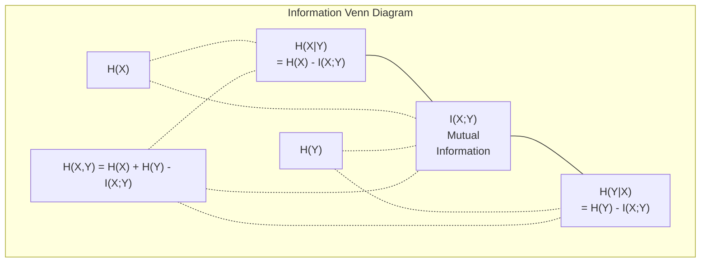

# 信息论 (Information Theory)

> 信息论用于衡量“惊奇度”（surprise）。损失函数 (Loss Functions) 正是构建于其基础之上。

**类型：** 学习
**语言：** Python
**前置要求：** 第一阶段，第 06 课（概率论 (Probability)）
**时长：** 约 60 分钟

## 学习目标

- 从零开始计算熵 (Entropy)、交叉熵 (Cross-Entropy) 和 KL散度 (KL Divergence)，并解释它们之间的关系
- 推导为何最小化交叉熵损失 (Cross-Entropy Loss) 等价于最大化对数似然 (Log-Likelihood)
- 计算特征与目标 (Target) 之间的互信息 (Mutual Information)，以对特征重要性 (Feature Importance) 进行排序
- 将困惑度 (Perplexity) 解释为语言模型 (Language Model) 进行选择的有效词汇量 (Effective Vocabulary Size)

## 问题

在你训练的每一个分类模型中，都会调用 `CrossEntropyLoss()`。在每一篇语言模型论文中，你都会看到“困惑度”（perplexity）。在变分自编码器（VAEs）、知识蒸馏（distillation）和基于人类反馈的强化学习（RLHF）的相关资料中，你都会读到关于KL散度（KL divergence）的内容。这些并非彼此孤立的概念，它们其实是同一个核心思想换上了不同的外衣。

信息论（Information theory）为你提供了推演不确定性、数据压缩与预测能力的语言体系。克劳德·香农（Claude Shannon）于1948年创立了该理论，初衷是为了解决通信问题。事实证明，训练神经网络（neural network）本质上也是一个通信问题：模型正试图通过由学习到的权重构成的噪声信道，来传输正确的标签。

本节课程将从零开始推导每一个公式，让你看清它们的来源以及为何有效。

## 概念

### Information Content (Surprise)

When something unlikely happens, it carries more information. A coin landing heads? Not surprising. A lottery win? Very surprising.

The information content of an event with probability p is:

```
I(x) = -log(p(x))
```

Using log base 2 gives you bits. Using natural log gives you nats. Same idea, different units.

```
Event              Probability    Surprise (bits)
Fair coin heads    0.5            1.0
Rolling a 6        0.167          2.58
1-in-1000 event    0.001          9.97
Certain event      1.0            0.0
```

Certain events carry zero information. You already knew they would happen.

### Entropy (Average Surprise)

Entropy is the expected surprise across all possible outcomes of a distribution.

```
H(P) = -sum( p(x) * log(p(x)) )  for all x
```

A fair coin has maximum entropy for a binary variable: 1 bit. A biased coin (99% heads) has low entropy: 0.08 bits. You already know what will happen, so each flip tells you almost nothing.

```
Fair coin:    H = -(0.5 * log2(0.5) + 0.5 * log2(0.5)) = 1.0 bit
Biased coin:  H = -(0.99 * log2(0.99) + 0.01 * log2(0.01)) = 0.08 bits
```

Entropy measures the irreducible uncertainty in a distribution. You cannot compress below it.

### Cross-Entropy (The Loss Function You Use Every Day)

Cross-entropy measures the average surprise when you use distribution Q to encode events that actually come from distribution P.

```
H(P, Q) = -sum( p(x) * log(q(x)) )  for all x
```

P is the true distribution (the labels). Q is your model's predictions. If Q matches P perfectly, cross-entropy equals entropy. Any mismatch makes it larger.

In classification, P is a one-hot vector (the true class has probability 1, everything else 0). This simplifies cross-entropy to:

```
H(P, Q) = -log(q(true_class))
```

That is the entire cross-entropy loss formula for classification. Maximize the predicted probability of the correct class.

### KL Divergence (Distance Between Distributions)

KL divergence measures how much extra surprise you get from using Q instead of P.

```
D_KL(P || Q) = sum( p(x) * log(p(x) / q(x)) )  for all x
             = H(P, Q) - H(P)
```

Cross-entropy is entropy plus KL divergence. Since entropy of the true distribution is constant during training, minimizing cross-entropy is the same as minimizing KL divergence. You are pushing your model's distribution toward the true distribution.

KL divergence is not symmetric: D_KL(P || Q) != D_KL(Q || P). It is not a true distance metric.

### Mutual Information

Mutual information measures how much knowing one variable tells you about another.

```
I(X; Y) = H(X) - H(X|Y)
        = H(X) + H(Y) - H(X, Y)
```

If X and Y are independent, mutual information is zero. Knowing one tells you nothing about the other. If they are perfectly correlated, mutual information equals the entropy of either variable.

In feature selection, high mutual information between a feature and the target means the feature is useful. Low mutual information means it is noise.

### Conditional Entropy

H(Y|X) measures how much uncertainty remains about Y after you observe X.

```
H(Y|X) = H(X,Y) - H(X)
```

Two extremes:
- If X completely determines Y, then H(Y|X) = 0. Knowing X eliminates all uncertainty about Y. Example: X = temperature in Celsius, Y = temperature in Fahrenheit.
- If X tells you nothing about Y, then H(Y|X) = H(Y). Knowing X does not reduce your uncertainty at all. Example: X = coin flip, Y = tomorrow's weather.

Conditional entropy is always non-negative and never exceeds H(Y):

```
0 <= H(Y|X) <= H(Y)
```

In machine learning, conditional entropy appears in decision trees. At each split, the algorithm picks the feature X that minimizes H(Y|X) -- the feature that removes the most uncertainty about the label Y.

### Joint Entropy

H(X,Y) is the entropy of the joint distribution of X and Y together.

```
H(X,Y) = -sum sum p(x,y) * log(p(x,y))   for all x, y
```

Key property:

```
H(X,Y) <= H(X) + H(Y)
```

Equality holds when X and Y are independent. If they share information, the joint entropy is less than the sum of individual entropies. The "missing" entropy is exactly the mutual information.



The relationships:
- H(X,Y) = H(X) + H(Y|X) = H(Y) + H(X|Y)
- I(X;Y) = H(X) - H(X|Y) = H(Y) - H(Y|X)
- H(X,Y) = H(X) + H(Y) - I(X;Y)

### Mutual Information (Deep Dive)

Mutual information I(X;Y) quantifies how much knowing one variable reduces uncertainty about the other.

```
I(X;Y) = H(X) - H(X|Y)
       = H(Y) - H(Y|X)
       = H(X) + H(Y) - H(X,Y)
       = sum sum p(x,y) * log(p(x,y) / (p(x) * p(y)))
```

Properties:
- I(X;Y) >= 0 always. You never lose information by observing something.
- I(X;Y) = 0 if and only if X and Y are independent.
- I(X;Y) = I(Y;X). It is symmetric, unlike KL divergence.
- I(X;X) = H(X). A variable shares all its information with itself.

**Mutual information for feature selection.** In ML, you want features that are informative about the target. Mutual information gives you a principled way to rank features:

1. For each feature X_i, compute I(X_i; Y) where Y is the target variable.
2. Rank features by MI score.
3. Keep the top k features.

This works for any relationship between feature and target -- linear, nonlinear, monotonic, or not. Correlation only catches linear relationships. MI catches everything.

| Method | Detects | Computational cost | Handles categorical? |
|--------|---------|-------------------|---------------------|
| Pearson correlation | Linear relationships | O(n) | No |
| Spearman correlation | Monotonic relationships | O(n log n) | No |
| Mutual information | Any statistical dependency | O(n log n) with binning | Yes |

### Label Smoothing and Cross-Entropy

Standard classification uses hard targets: [0, 0, 1, 0]. The true class gets probability 1, everything else gets 0. Label smoothing replaces these with soft targets:

```
soft_target = (1 - epsilon) * hard_target + epsilon / num_classes
```

With epsilon = 0.1 and 4 classes:
- Hard target:  [0, 0, 1, 0]
- Soft target:  [0.025, 0.025, 0.925, 0.025]

From an information theory perspective, label smoothing increases the entropy of the target distribution. Hard one-hot targets have entropy 0 -- there is no uncertainty. Soft targets have positive entropy.

Why this helps:
- Prevents the model from driving logits to extreme values (infinite logits would be needed to perfectly match a one-hot target under cross-entropy)
- Acts as regularization: the model cannot be 100% confident
- Improves calibration: predicted probabilities better reflect true uncertainty
- Reduces the gap between training and inference behavior

The cross-entropy loss with label smoothing becomes:

```
L = (1 - epsilon) * CE(hard_target, prediction) + epsilon * H_uniform(prediction)
```

The second term penalizes predictions that are far from uniform -- a direct regularization on confidence.

### Why Cross-Entropy Is THE Classification Loss

Three perspectives, same conclusion.

**Information theory view.** Cross-entropy measures how many bits you waste by using your model's distribution instead of the true distribution. Minimizing it makes your model the most efficient encoder of reality.

**Maximum likelihood view.** For N training samples with true classes y_i:

```
Likelihood     = product( q(y_i) )
Log-likelihood = sum( log(q(y_i)) )
Negative log-likelihood = -sum( log(q(y_i)) )
```

That last line is cross-entropy loss. Minimizing cross-entropy = maximizing the likelihood of the training data under your model.

**Gradient view.** The gradient of cross-entropy with respect to the logits is simply (predicted - true). Clean, stable, and fast to compute. This is why it pairs perfectly with softmax.

### Bits vs Nats

The only difference is the log base.

```
log base 2   -> bits      (information theory tradition)
log base e   -> nats      (machine learning convention)
log base 10  -> hartleys  (rarely used)
```

1 nat = 1/ln(2) bits = 1.4427 bits. PyTorch and TensorFlow use natural log (nats) by default.

### Perplexity

Perplexity is the exponential of cross-entropy. It tells you the effective number of equally likely choices the model is uncertain between.

```
Perplexity = 2^H(P,Q)   (if using bits)
Perplexity = e^H(P,Q)   (if using nats)
```

A language model with perplexity 50 is, on average, as confused as if it had to pick uniformly from 50 possible next tokens. Lower is better.

GPT-2 achieved perplexity ~30 on common benchmarks. Modern models are in the single digits for well-represented domains.

## 构建

### 步骤 1：信息量 (Information Content) 与熵 (Entropy)

import math

def information_content(p, base=2):
    if p <= 0 or p > 1:
        return float('inf') if p <= 0 else 0.0
    return -math.log(p) / math.log(base)

def entropy(probs, base=2):
    return sum(
        p * information_content(p, base)
        for p in probs if p > 0
    )

fair_coin = [0.5, 0.5]
biased_coin = [0.99, 0.01]
fair_die = [1/6] * 6

print(f"Fair coin entropy:   {entropy(fair_coin):.4f} bits")
print(f"Biased coin entropy: {entropy(biased_coin):.4f} bits")
print(f"Fair die entropy:    {entropy(fair_die):.4f} bits")

### 步骤 2：交叉熵 (Cross-Entropy) 与 KL 散度 (KL Divergence)

def cross_entropy(p, q, base=2):
    total = 0.0
    for pi, qi in zip(p, q):
        if pi > 0:
            if qi <= 0:
                return float('inf')
            total += pi * (-math.log(qi) / math.log(base))
    return total

def kl_divergence(p, q, base=2):
    return cross_entropy(p, q, base) - entropy(p, base)

true_dist = [0.7, 0.2, 0.1]
good_model = [0.6, 0.25, 0.15]
bad_model = [0.1, 0.1, 0.8]

print(f"Entropy of true dist:     {entropy(true_dist):.4f} bits")
print(f"CE (good model):          {cross_entropy(true_dist, good_model):.4f} bits")
print(f"CE (bad model):           {cross_entropy(true_dist, bad_model):.4f} bits")
print(f"KL divergence (good):     {kl_divergence(true_dist, good_model):.4f} bits")
print(f"KL divergence (bad):      {kl_divergence(true_dist, bad_model):.4f} bits")

### 步骤 3：作为分类损失 (Classification Loss) 的交叉熵

def softmax(logits):
    max_logit = max(logits)
    exps = [math.exp(z - max_logit) for z in logits]
    total = sum(exps)
    return [e / total for e in exps]

def cross_entropy_loss(true_class, logits):
    probs = softmax(logits)
    return -math.log(probs[true_class])

logits = [2.0, 1.0, 0.1]
true_class = 0

probs = softmax(logits)
loss = cross_entropy_loss(true_class, logits)

print(f"Logits:      {logits}")
print(f"Softmax:     {[f'{p:.4f}' for p in probs]}")
print(f"True class:  {true_class}")
print(f"Loss:        {loss:.4f} nats")
print(f"Perplexity:  {math.exp(loss):.2f}")

### 步骤 4：交叉熵等于负对数似然 (Negative Log-Likelihood)

import random

random.seed(42)

n_samples = 1000
n_classes = 3
true_labels = [random.randint(0, n_classes - 1) for _ in range(n_samples)]
model_logits = [[random.gauss(0, 1) for _ in range(n_classes)] for _ in range(n_samples)]

ce_loss = sum(
    cross_entropy_loss(label, logits)
    for label, logits in zip(true_labels, model_logits)
) / n_samples

nll = -sum(
    math.log(softmax(logits)[label])
    for label, logits in zip(true_labels, model_logits)
) / n_samples

print(f"Cross-entropy loss:      {ce_loss:.6f}")
print(f"Negative log-likelihood: {nll:.6f}")
print(f"Difference:              {abs(ce_loss - nll):.2e}")

### 步骤 5：互信息 (Mutual Information)

def mutual_information(joint_probs, base=2):
    rows = len(joint_probs)
    cols = len(joint_probs[0])

    margin_x = [sum(joint_probs[i][j] for j in range(cols)) for i in range(rows)]
    margin_y = [sum(joint_probs[i][j] for i in range(rows)) for j in range(cols)]

    mi = 0.0
    for i in range(rows):
        for j in range(cols):
            pxy = joint_probs[i][j]
            if pxy > 0:
                mi += pxy * math.log(pxy / (margin_x[i] * margin_y[j])) / math.log(base)
    return mi

independent = [[0.25, 0.25], [0.25, 0.25]]
dependent = [[0.45, 0.05], [0.05, 0.45]]

print(f"MI (independent): {mutual_information(independent):.4f} bits")
print(f"MI (dependent):   {mutual_information(dependent):.4f} bits")


## 使用方法

使用 NumPy 实现相同概念，这也是你在实际开发中的使用方式：

import numpy as np

def np_entropy(p):
    p = np.asarray(p, dtype=float)
    mask = p > 0
    result = np.zeros_like(p)
    result[mask] = p[mask] * np.log(p[mask])
    return -result.sum()

def np_cross_entropy(p, q):
    p, q = np.asarray(p, dtype=float), np.asarray(q, dtype=float)
    mask = p > 0
    return -(p[mask] * np.log(q[mask])).sum()

def np_kl_divergence(p, q):
    return np_cross_entropy(p, q) - np_entropy(p)

true = np.array([0.7, 0.2, 0.1])
pred = np.array([0.6, 0.25, 0.15])
print(f"Entropy:    {np_entropy(true):.4f} nats")
print(f"Cross-ent:  {np_cross_entropy(true, pred):.4f} nats")
print(f"KL div:     {np_kl_divergence(true, pred):.4f} nats")

你从零开始实现了 `torch.nn.CrossEntropyLoss()` 的内部机制。现在你明白了为什么在训练（Training）过程中损失（Loss）会下降：你的模型预测分布（Predicted Distribution）正逐渐逼近真实分布（True Distribution），其差距以浪费的信息量（nats）来衡量。

## 练习

1. 假设英语字母表服从均匀分布（Uniform Distribution）（共26个字母），计算其熵（Entropy）。然后使用实际的字母频率进行估算。哪个值更高？为什么？

2. 对于一个真实类别为 1 的样本，模型输出的对数几率（Logits）为 [5.0, 2.0, 0.5]。请手动计算交叉熵损失（Cross-Entropy Loss），然后使用你的 `cross_entropy_loss` 函数进行验证。什么样的 Logits 会使损失为零？

3. 证明KL散度（KL Divergence）不具有对称性。选取两个分布 P 和 Q，分别计算 D_KL(P || Q) 和 D_KL(Q || P)。解释它们为何不同。

4. 构建一个函数，用于计算词元（Token）预测序列的困惑度（Perplexity）。给定一个由 `(true_token_index, predicted_logits)` 对组成的列表，返回该序列的困惑度。

## 关键术语

| 术语 | 常见说法 | 实际含义 |
|------|----------------|----------------------|
| 信息量 (Information content) | “意外程度” | 编码一个事件所需的比特数（或纳特数）：-log(p) |
| 熵 (Entropy) | “随机性” | 分布中所有结果的平均意外程度。用于衡量不可消除的不确定性。 |
| 交叉熵 (Cross-entropy) | “损失函数” | 使用模型分布 Q 对来自真实分布 P 的事件进行编码时的平均意外程度。 |
| KL 散度 (KL divergence) | “分布之间的距离” | 使用 Q 代替 P 所浪费的额外比特数。等于交叉熵减去熵。不具备对称性。 |
| 互信息 (Mutual information) | “X 与 Y 的关联程度” | 已知 Y 后对 X 不确定性的减少量。值为零表示两者相互独立。 |
| Softmax (Softmax) | “将 logits 转换为概率” | 进行指数运算并归一化。将任意实数向量映射为有效的概率分布。 |
| 困惑度 (Perplexity) | “模型的困惑程度” | 交叉熵的指数。模型在每一步选择时实际面对的有效词表大小。 |
| 比特 (Bits) | “香农的单位” | 以 2 为底的对数度量的信息量。1 比特对应一次公平硬币投掷的结果。 |
| 纳特 (Nats) | “机器学习的单位” | 以自然对数度量的信息量。PyTorch 和 TensorFlow 默认使用该单位。 |
| 负对数似然 (Negative log-likelihood) | “NLL 损失” | 对于独热编码（one-hot）标签，其等同于交叉熵损失。最小化该值可最大化正确预测的概率。 |

## 延伸阅读

- [香农 1948：通信的数学理论 (A Mathematical Theory of Communication)](https://people.math.harvard.edu/~ctm/home/text/others/shannon/entropy/entropy.pdf) - 原始论文，至今仍具可读性
- [可视化信息理论 (Visual Information Theory) - Chris Olah](https://colah.github.io/posts/2015-09-Visual-Information/) - 对熵 (Entropy) 和 KL 散度 (KL Divergence) 的最佳可视化解释
- [PyTorch CrossEntropyLoss 文档](https://pytorch.org/docs/stable/generated/torch.nn.CrossEntropyLoss.html) - 该框架如何实现你刚刚构建的功能