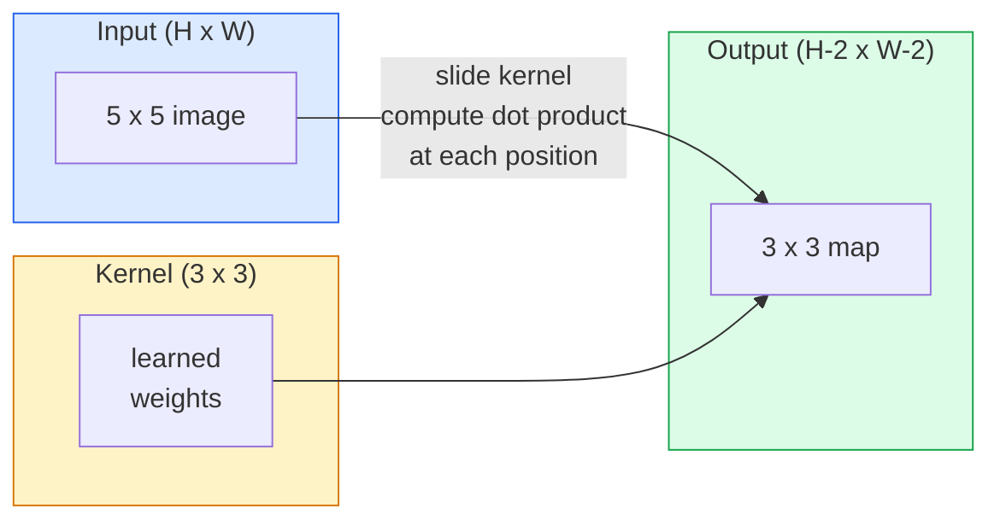
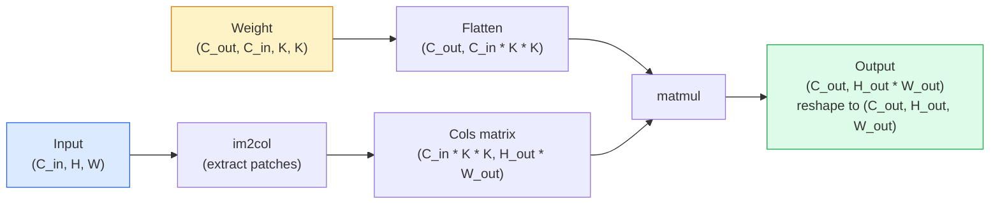

# 从零实现卷积（Convolutions from Scratch）

> 卷积（Convolution）是一个微小的全连接层（Dense Layer），通过在图像上滑动它，并在每个位置共享相同的权重。

**类型：** 构建
**语言：** Python
**先修要求：** 第 3 阶段（深度学习核心，Deep Learning Core），第 4 阶段第 01 课（图像基础，Image Fundamentals）
**时长：** 约 75 分钟

## 学习目标

- 仅使用 NumPy 从零实现二维卷积（2D convolution），包括嵌套循环版本与向量化 `im2col` 版本
- 针对输入尺寸、卷积核尺寸（kernel size）、填充（padding）和步幅（stride）的任意组合，计算输出空间尺寸，并论证 `(H - K + 2P) / S + 1` 公式的合理性
- 手工设计卷积核（边缘检测、模糊、锐化、Sobel），并解释各卷积核产生特定激活值（activations）模式的原因
- 将卷积操作堆叠为特征提取器（feature extractor），并阐明堆叠深度与感受野（receptive field）尺寸之间的关系

## 问题

对于一张 224x224 的 RGB 图像，全连接层（Fully Connected Layer）的每个神经元需要 224 * 224 * 3 = 150,528 个输入权重。仅一个包含 1,000 个单元的隐藏层（Hidden Layer）就已经需要 1.5 亿个参数——而此时模型还未学到任何有用的知识。更糟糕的是，该层无法理解左上角的狗和右下角的狗属于同一种模式。它将每个像素位置视为相互独立的，这恰恰违背了图像的特性：将一只猫平移三个像素，绝不应该迫使网络重新学习这一概念。

图像模型所需的两个核心特性是**平移等变性（Translation Equivariance）**（输入发生平移时，输出也随之平移）和**参数共享（Parameter Sharing）**（相同的特征检测器在图像各处运行）。密集层（Dense Layers）两者皆不具备。而卷积（Convolution）则能天然地同时提供这两项特性。

卷积并非为深度学习而发明。它是驱动 JPEG 压缩、Photoshop 中的高斯模糊、工业视觉中的边缘检测以及所有已发布音频滤波器的同一项运算。卷积神经网络（Convolutional Neural Networks, CNNs）之所以能在 2012 年至 2020 年间主导 ImageNet 竞赛，是因为卷积为这类数据提供了正确的先验（Prior）：即相邻数值相互关联，且相同的模式可能出现在任意位置。

## 概念

### One kernel, sliding

A 2D convolution takes a small weight matrix called the kernel (or filter), slides it across the input, and at each location computes the sum of element-wise products. That sum becomes one output pixel.



A concrete 3x3 example on a 5x5 input (no padding, stride 1):

```
Input X (5 x 5):                Kernel W (3 x 3):

  1  2  0  1  2                   1  0 -1
  0  1  3  1  0                   2  0 -2
  2  1  0  2  1                   1  0 -1
  1  0  2  1  3
  2  1  1  0  1

The kernel slides across every valid 3 x 3 window. Output Y is 3 x 3:

 Y[0,0] = sum( W * X[0:3, 0:3] )
 Y[0,1] = sum( W * X[0:3, 1:4] )
 Y[0,2] = sum( W * X[0:3, 2:5] )
 Y[1,0] = sum( W * X[1:4, 0:3] )
 ... and so on
```

That one formula — **shared weights, locality, sliding window** — is the entire idea. Everything else is bookkeeping.

### Output size formula

Given input spatial size `H`, kernel size `K`, padding `P`, stride `S`:

```
H_out = floor( (H - K + 2P) / S ) + 1
```

Memorise this. You will compute it dozens of times per architecture.

| Scenario | H | K | P | S | H_out |
|----------|---|---|---|---|-------|
| Valid conv, no padding | 32 | 3 | 0 | 1 | 30 |
| Same conv (preserves size) | 32 | 3 | 1 | 1 | 32 |
| Downsample by 2 | 32 | 3 | 1 | 2 | 16 |
| Pool 2x2 | 32 | 2 | 0 | 2 | 16 |
| Large receptive field | 32 | 7 | 3 | 2 | 16 |

"Same padding" means pick P so that H_out == H when S == 1. For odd K, that is P = (K - 1) / 2. That is why 3x3 kernels dominate — they are the smallest odd kernel that still has a centre.

### Padding

Without padding, every convolution shrinks the feature map. Stack 20 of them and your 224x224 image becomes 184x184, which wastes compute on the border and complicates residual connections that need matching shapes.

```
Zero padding (P = 1) on a 5 x 5 input:

  0  0  0  0  0  0  0
  0  1  2  0  1  2  0
  0  0  1  3  1  0  0
  0  2  1  0  2  1  0       Now the kernel can centre on pixel
  0  1  0  2  1  3  0       (0, 0) and still have three rows and
  0  2  1  1  0  1  0       three columns of values to multiply.
  0  0  0  0  0  0  0
```

Modes you meet in practice: `zero` (most common), `reflect` (mirror the edge, avoids hard borders in generative models), `replicate` (copy the edge), `circular` (wrap around, used in toroidal problems).

### Stride

Stride is the step size of the slide. `stride=1` is the default. `stride=2` halves the spatial dimensions and is the classic way to downsample inside a CNN without a separate pooling layer — every modern architecture (ResNet, ConvNeXt, MobileNet) uses strided convs in place of max-pool somewhere.

```
Stride 1 on a 5 x 5 input, 3 x 3 kernel:

  starts: (0,0) (0,1) (0,2)        -> output row 0
          (1,0) (1,1) (1,2)        -> output row 1
          (2,0) (2,1) (2,2)        -> output row 2

  Output: 3 x 3

Stride 2 on the same input:

  starts: (0,0) (0,2)              -> output row 0
          (2,0) (2,2)              -> output row 1

  Output: 2 x 2
```

### Multiple input channels

Real images have three channels. A 3x3 convolution on an RGB input is actually a 3x3x3 volume: one 3x3 slice per input channel. At each spatial position, you multiply and sum across all three slices and add a bias.

```
Input:   (C_in,  H,  W)        3 x 5 x 5
Kernel:  (C_in,  K,  K)        3 x 3 x 3 (one kernel)
Output:  (1,     H', W')       2D map

For a layer that produces C_out output channels, you stack C_out kernels:

Weight:  (C_out, C_in, K, K)   e.g. 64 x 3 x 3 x 3
Output:  (C_out, H', W')       64 x 3 x 3

Parameter count: C_out * C_in * K * K + C_out   (the + C_out is biases)
```

That last line is the one you will calculate when planning a model. A 64-channel 3x3 conv on a 3-channel input has `64 * 3 * 3 * 3 + 64 = 1,792` parameters. Cheap.

### The im2col trick

Nested loops are easy to read but slow. GPUs want big matrix multiplies. The trick: flatten every receptive-field window of the input into one column of a big matrix, flatten the kernel into a row, and the whole convolution becomes a single matmul.



Every production conv implementation is some variant of this plus cache-tiling tricks (direct conv, Winograd, FFT conv for large kernels). Understand im2col and you understand the core.

### Receptive field

A single 3x3 conv looks at 9 input pixels. Stack two 3x3 convs and a neuron in the second layer looks at 5x5 input pixels. Three 3x3 convs give 7x7. In general:

```
RF after L stacked K x K convs (stride 1) = 1 + L * (K - 1)

With strides:   RF grows multiplicatively with stride along each layer.
```

The entire reason "3x3 all the way down" works (VGG, ResNet, ConvNeXt) is that two 3x3 convs see the same input area as one 5x5 conv but with fewer parameters and an extra non-linearity in between.

## 构建它

### 步骤 1：数组填充 (Array Padding)

从最基础的原语开始：一个在 H x W 数组周围进行零填充 (zero padding) 的函数。

import numpy as np

def pad2d(x, p):
    if p == 0:
        return x
    h, w = x.shape[-2:]
    out = np.zeros(x.shape[:-2] + (h + 2 * p, w + 2 * p), dtype=x.dtype)
    out[..., p:p + h, p:p + w] = x
    return out

x = np.arange(9).reshape(3, 3)
print(x)
print()
print(pad2d(x, 1))

利用末尾轴切片技巧 `x.shape[:-2]`，同一个函数无需修改即可直接处理 `(H, W)`、`(C, H, W)` 或 `(N, C, H, W)` 形状的张量。

### 步骤 2：使用嵌套循环实现二维卷积 (2D Convolution)

参考实现——速度较慢，但逻辑清晰明确。从原理上讲，这正是 `torch.nn.functional.conv2d` 所做的事情。

def conv2d_naive(x, w, b=None, stride=1, padding=0):
    c_in, h, w_in = x.shape
    c_out, c_in_w, kh, kw = w.shape
    assert c_in == c_in_w

    x_pad = pad2d(x, padding)
    h_out = (h + 2 * padding - kh) // stride + 1
    w_out = (w_in + 2 * padding - kw) // stride + 1

    out = np.zeros((c_out, h_out, w_out), dtype=np.float32)
    for oc in range(c_out):
        for i in range(h_out):
            for j in range(w_out):
                hs = i * stride
                ws = j * stride
                patch = x_pad[:, hs:hs + kh, ws:ws + kw]
                out[oc, i, j] = np.sum(patch * w[oc])
        if b is not None:
            out[oc] += b[oc]
    return out

四层嵌套循环（输出通道、行、列，加上对 C_in、kh、kw 的隐式求和）。这是你将用来验证所有更快实现的基准真值 (ground truth)。

### 步骤 3：使用手工设计的卷积核进行验证

构建一个垂直方向的 Sobel 卷积核 (Sobel kernel)，将其应用于合成的阶跃图像 (step image)，观察垂直边缘如何被激活。

def synthetic_step_image():
    img = np.zeros((1, 16, 16), dtype=np.float32)
    img[:, :, 8:] = 1.0
    return img

sobel_x = np.array([
    [[-1, 0, 1],
     [-2, 0, 2],
     [-1, 0, 1]]
], dtype=np.float32)[None]

x = synthetic_step_image()
y = conv2d_naive(x, sobel_x, padding=1)
print(y[0].round(1))

预期在第 7 列出现较大的正值（从左到右亮度增加），其余位置均为零。这唯一的一行打印输出就是你的健全性检查 (sanity check)，用于确认数学计算是否正确。

### 步骤 4：图像转列 (im2col)

将输入中每个与卷积核大小相同的窗口转换为矩阵的一列。对于 `C_in=3, K=3` 的情况，每列包含 27 个数值。

def im2col(x, kh, kw, stride=1, padding=0):
    c_in, h, w = x.shape
    x_pad = pad2d(x, padding)
    h_out = (h + 2 * padding - kh) // stride + 1
    w_out = (w + 2 * padding - kw) // stride + 1

    cols = np.zeros((c_in * kh * kw, h_out * w_out), dtype=x.dtype)
    col = 0
    for i in range(h_out):
        for j in range(w_out):
            hs = i * stride
            ws = j * stride
            patch = x_pad[:, hs:hs + kh, ws:ws + kw]
            cols[:, col] = patch.reshape(-1)
            col += 1
    return cols, h_out, w_out

这里仍然使用了 Python 循环，但繁重的计算工作现在将由一次向量化矩阵乘法 (vectorised matmul) 来完成。

### 步骤 5：通过 im2col + 矩阵乘法实现快速卷积

用一次矩阵乘法替换四重循环。

def conv2d_im2col(x, w, b=None, stride=1, padding=0):
    c_out, c_in, kh, kw = w.shape
    cols, h_out, w_out = im2col(x, kh, kw, stride, padding)
    w_flat = w.reshape(c_out, -1)
    out = w_flat @ cols
    if b is not None:
        out += b[:, None]
    return out.reshape(c_out, h_out, w_out)

正确性检查：运行两种实现并进行对比。

rng = np.random.default_rng(0)
x = rng.normal(0, 1, (3, 16, 16)).astype(np.float32)
w = rng.normal(0, 1, (8, 3, 3, 3)).astype(np.float32)
b = rng.normal(0, 1, (8,)).astype(np.float32)

y_naive = conv2d_naive(x, w, b, padding=1)
y_im2col = conv2d_im2col(x, w, b, padding=1)

print(f"max abs diff: {np.max(np.abs(y_naive - y_im2col)):.2e}")

`max abs diff`（最大绝对差值）应在 `1e-5` 左右——该差异源于浮点数累加顺序的不同，而非程序错误。

### 步骤 6：一组手工设计的卷积核

五个滤波器，展示了单个卷积层 (convolutional layer) 在未经任何训练前所能表达的特征。

KERNELS = {
    "identity": np.array([[0, 0, 0], [0, 1, 0], [0, 0, 0]], dtype=np.float32),
    "blur_3x3": np.ones((3, 3), dtype=np.float32) / 9.0,
    "sharpen": np.array([[0, -1, 0], [-1, 5, -1], [0, -1, 0]], dtype=np.float32),
    "sobel_x": np.array([[-1, 0, 1], [-2, 0, 2], [-1, 0, 1]], dtype=np.float32),
    "sobel_y": np.array([[-1, -2, -1], [0, 0, 0], [1, 2, 1]], dtype=np.float32),
}

def apply_kernel(img2d, kernel):
    x = img2d[None].astype(np.float32)
    w = kernel[None, None]
    return conv2d_im2col(x, w, padding=1)[0]

应用于任何灰度图像时，模糊 (blur) 会使图像柔和，锐化 (sharpen) 会增强边缘清晰度，Sobel-x 会激活垂直边缘，Sobel-y 会激活水平边缘。这正是 AlexNet 和 VGG 中*第一个*训练后的卷积层最终学到的模式——因为无论后续任务是什么，一个优秀的图像模型都需要边缘与斑点检测器 (edge and blob detectors)。

## 使用方法

PyTorch 的 `nn.Conv2d` 封装了相同的操作，并集成了自动微分（autograd）、CUDA 内核（CUDA kernels）以及 cuDNN 优化（cuDNN optimisation）。其形状语义（Shape semantics）完全一致。

import torch
import torch.nn as nn

conv = nn.Conv2d(in_channels=3, out_channels=64, kernel_size=3, stride=1, padding=1)
print(conv)
print(f"weight shape: {tuple(conv.weight.shape)}   # (C_out, C_in, K, K)")
print(f"bias shape:   {tuple(conv.bias.shape)}")
print(f"param count:  {sum(p.numel() for p in conv.parameters())}")

x = torch.randn(8, 3, 224, 224)
y = conv(x)
print(f"\ninput  shape: {tuple(x.shape)}")
print(f"output shape: {tuple(y.shape)}")

将 `padding=1` 替换为 `padding=0`，输出尺寸将降至 222x222。将 `stride=1` 替换为 `stride=2`，输出尺寸将降至 112x112。这与你上文记忆的公式完全一致。

## 发布上线

本课程将生成以下内容：

- `outputs/prompt-cnn-architect.md` — 一个提示词（prompt），在给定输入尺寸（input size）、参数预算（parameter budget）和目标感受野（receptive field）的情况下，为每一步设计具有合适卷积核大小/步长/填充（K/S/P）的 `Conv2d` 层堆栈。
- `outputs/skill-conv-shape-calculator.md` — 一项技能（skill），逐层遍历网络配置（network spec），并返回每个模块（block）的输出形状（output shape）、感受野和参数量（parameter count）。

## 练习

1. **(简单)** 给定一个 128x128 的灰度输入 (grayscale input) 以及一组堆叠的 `[Conv3x3(s=1,p=1), Conv3x3(s=2,p=1), Conv3x3(s=1,p=1), Conv3x3(s=2,p=1)]`，请手动计算每一层的输出空间尺寸 (spatial size) 和感受野 (receptive field)。使用包含虚拟卷积层 (dummy convs) 的 PyTorch `nn.Sequential` 进行验证。
2. **(中等)** 扩展 `conv2d_naive` 和 `conv2d_im2col` 以接受 `groups` 参数。证明当 `groups=C_in=C_out` 时，其实现等同于深度卷积 (depthwise convolution)，且其参数量 (parameter count) 为 `C * K * K` 而非 `C * C * K * K`。
3. **(困难)** 手动实现 `conv2d_im2col` 的反向传播 (backward pass)：给定输出的梯度 (gradient)，计算 `x` 和 `w` 的梯度。在相同的输入和权重下，与 `torch.autograd.grad` 的结果进行对比验证。关键技巧在于：im2col 的梯度计算对应于 `col2im`，并且必须对重叠窗口 (overlapping windows) 进行累加。

## 关键术语

| 术语 | 通俗说法 | 实际含义 |
|------|----------------|----------------------|
| 卷积 (Convolution) | “滑动滤波器” | 一种在每个空间位置上应用共享权重的可学习点积运算；数学上实为互相关（cross-correlation），但业界普遍称之为卷积 |
| 卷积核 / 滤波器 (Kernel / Filter) | “特征检测器” | 形状为 `(C_in, K, K)` 的小型权重张量，其与输入局部窗口的点积运算将生成单个输出像素 |
| 步长 (Stride) | “跳跃的距离” | 连续两次卷积核滑动之间的步距；步长为 2 会使输出的每个空间维度尺寸减半 |
| 填充 (Padding) | “边缘补零” | 在输入数据周围补充的额外数值，以便卷积核能够以边界像素为中心进行计算；`same` 填充可确保输出尺寸与输入保持一致 |
| 感受野 (Receptive Field) | “神经元能看到多大范围” | 某个特定输出激活值所依赖的原始输入区域，其范围会随网络深度和步长的增加而扩大 |
| im2col | “GEMM 技巧” | 将每个感受野窗口重排为列向量，从而使卷积运算转化为一次大型矩阵乘法——这是所有快速卷积内核的核心实现方式 |
| 逐通道卷积 (Depthwise Conv) | “每个通道一个卷积核” | 设置 `groups == C_in` 的卷积操作，每个输出通道仅由其对应的输入通道独立计算得出；该结构是 MobileNet 和 ConvNeXt 等架构的核心骨干 |
| 平移等变性 (Translation Equivariance) | “输入平移，输出随之平移” | 当输入平移 k 个像素时，输出也会相应平移 k 个像素的特性；这是共享权重机制带来的天然属性 |

## 延伸阅读

- [深度学习卷积运算指南 (Dumoulin & Visin, 2016)](https://arxiv.org/abs/1603.07285) — 关于填充 (padding)、步长 (stride) 与空洞率 (dilation) 的权威图解，几乎所有课程都在默默借鉴
- [CS231n：用于视觉识别的卷积神经网络](https://cs231n.github.io/convolutional-networks/) — 权威讲义，包含对 im2col 的原始讲解
- [带注释的卷积网络 (fast.ai)](https://nbviewer.org/github/fastai/fastbook/blob/master/13_convolutions.ipynb) — 一份交互式笔记本 (notebook)，逐步引导读者从手动实现卷积过渡到训练数字分类器
- [CNN 感受野计算 (Dang Ha The Hien)](https://distill.pub/2019/computing-receptive-fields/) — 达到论文级质量的交互式讲解，详细阐释感受野 (receptive field) 的计算方法