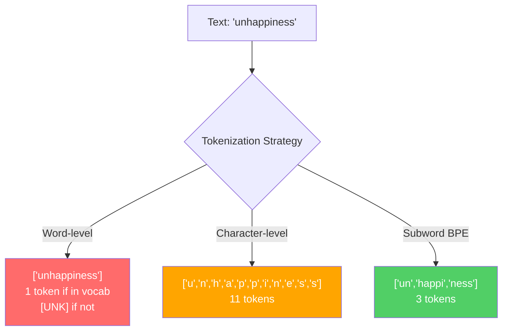
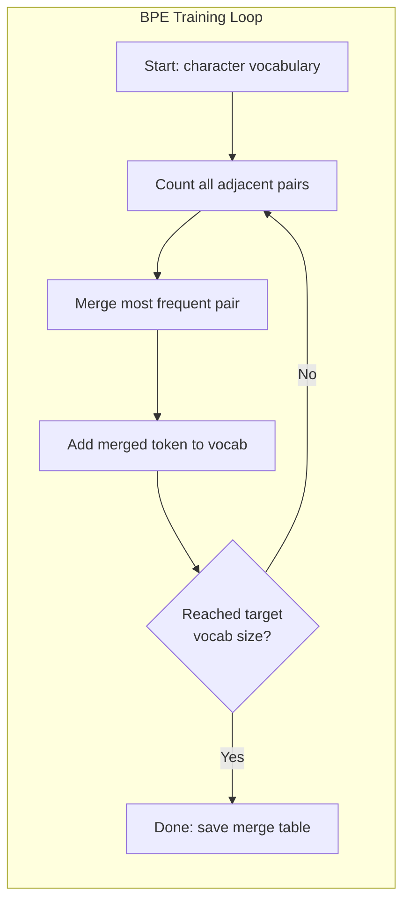
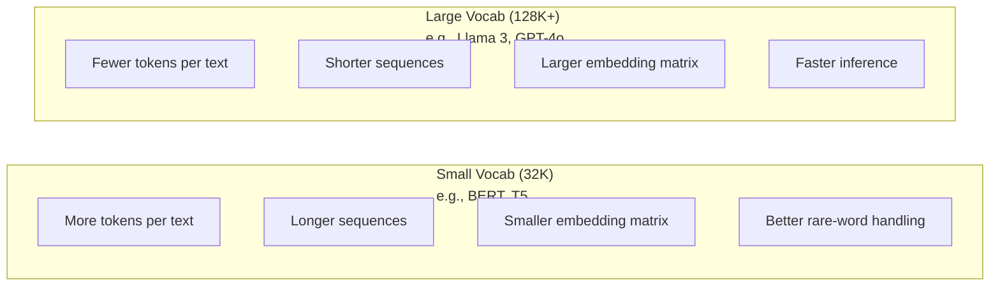

# 分词器 (Tokenizers)：BPE、WordPiece 与 SentencePiece

> 你的大语言模型 (LLM) 并不阅读英文。它读取的是整数。分词器 (Tokenizer) 决定了这些整数是承载语义，还是徒耗资源。

**类型：** 构建 (Build)
**语言：** Python
**前置要求：** 第 05 阶段（自然语言处理基础 (NLP Foundations)）
**时长：** 约 90 分钟

## 学习目标

- 从零实现 BPE (Byte Pair Encoding)、WordPiece 和 Unigram 分词算法 (Tokenization Algorithms)，并对比它们的合并策略 (Merge Strategies)
- 解释词表大小 (Vocabulary Size) 如何影响模型效率 (Model Efficiency)：过小会导致序列 (Sequences) 过长，过大则会浪费嵌入参数 (Embedding Parameters)
- 分析跨语言与代码场景中的分词异常 (Tokenization Artifacts)，识别特定分词器 (Tokenizers) 失效的具体情形
- 使用 tiktoken 和 sentencepiece 库对文本进行分词，并检查生成的词元 ID (Token IDs)

## 问题

你的大语言模型（LLM）并不懂英语。它也不懂任何语言。它读取的只是数字。

连接 “Hello, world!” 与 [15496, 11, 995, 0] 的正是分词器（tokenizer）。在模型能够处理之前，每个单词、每个空格和每个标点符号都必须转换为整数。这种转换并非中立客观。它会将某些预设假设“固化”到模型中，且后期无法逆转。

如果分词策略不当，模型就会浪费宝贵的容量，用多个词元（token）去编码常见词汇。例如，“unfortunately” 会被拆分成四个词元，而非一个。对于包含大量多音节词的文本，你的 128K 上下文窗口（context window）有效容量将直接缩水 75%。反之，若分词得当，同样的上下文窗口所能承载的信息量将翻倍。一个模型究竟是“擅长处理代码”还是“在 Python 面前频频卡壳”，其关键往往就在于分词器的训练方式。

你向 GPT-4 或 Claude 发起的每一次 API 调用，均按词元数量计费。模型生成的每一个词元都会消耗计算资源。表示输出结果所需的词元越少，端到端推理（inference）的速度就越快。分词绝非简单的预处理步骤，而是模型架构的核心组成部分。

## 概念

### Three Approaches That Failed (and One That Won)

There are three obvious ways to convert text to numbers. Two of them do not work at scale.

**Word-level tokenization** splits on spaces and punctuation. "The cat sat" becomes ["The", "cat", "sat"]. Simple. But what about "tokenization"? Or "GPT-4o"? Or a German compound word like "Geschwindigkeitsbegrenzung"? Word-level requires a massive vocabulary to cover every word in every language. Miss a word and you get the dreaded `[UNK]` token -- the model's way of saying "I have no idea what this is." English alone has over a million word forms. Add code, URLs, scientific notation, and 100 other languages and you need an infinite vocabulary.

**Character-level tokenization** goes the other direction. "hello" becomes ["h", "e", "l", "l", "o"]. Vocabulary is tiny (a few hundred characters). No unknown tokens ever. But sequences become extremely long. A sentence that would be 10 word-level tokens becomes 50 character-level tokens. The model must learn that "t", "h", "e" together mean "the" -- burning attention capacity on something a human learns at age three.

**Subword tokenization** finds the sweet spot. Common words stay whole: "the" is one token. Rare words decompose into meaningful pieces: "unhappiness" becomes ["un", "happi", "ness"]. Vocabulary stays manageable (30K to 128K tokens). Sequences stay short. Unknown tokens essentially disappear because any word can be built from subword pieces.

Every modern LLM uses subword tokenization. GPT-2, GPT-4, BERT, Llama 3, Claude -- all of them. The question is which algorithm.



### BPE: Byte Pair Encoding

BPE is a greedy compression algorithm repurposed for tokenization. The idea is simple enough to fit on an index card.

Start with individual characters. Count every adjacent pair in the training corpus. Merge the most frequent pair into a new token. Repeat until you reach your target vocabulary size.

Here is BPE running on a tiny corpus with the words "lower", "lowest", and "newest":

```
Corpus (with word frequencies):
  "lower"  x5
  "lowest" x2
  "newest" x6

Step 0 -- Start with characters:
  l o w e r       (x5)
  l o w e s t     (x2)
  n e w e s t     (x6)

Step 1 -- Count adjacent pairs:
  (e,s): 8    (s,t): 8    (l,o): 7    (o,w): 7
  (w,e): 13   (e,r): 5    (n,e): 6    ...

Step 2 -- Merge most frequent pair (w,e) -> "we":
  l o we r        (x5)
  l o we s t      (x2)
  n e we s t      (x6)

Step 3 -- Recount and merge (e,s) -> "es":
  l o we r        (x5)
  l o we s t      (x2)    <- 'es' only forms from 'e'+'s', not 'we'+'s'
  n e we s t      (x6)    <- wait, the 'e' before 'we' and 's' after 'we'

Actually tracking this precisely:
  After "we" merge, remaining pairs:
  (l,o): 7   (o,we): 7   (we,r): 5   (we,s): 8
  (s,t): 8   (n,e): 6    (e,we): 6

Step 3 -- Merge (we,s) -> "wes" or (s,t) -> "st" (tied at 8, pick first):
  Merge (we,s) -> "wes":
  l o we r        (x5)
  l o wes t       (x2)
  n e wes t       (x6)

Step 4 -- Merge (wes,t) -> "west":
  l o we r        (x5)
  l o west        (x2)
  n e west        (x6)

...continue until target vocab size reached.
```

The merge table is the tokenizer. To encode new text, apply merges in the order they were learned. The training corpus determines which merges exist, and that choice permanently shapes what the model sees.



### Byte-Level BPE (GPT-2, GPT-3, GPT-4)

Standard BPE operates on Unicode characters. Byte-level BPE operates on raw bytes (0-255). This gives you a base vocabulary of exactly 256, handles any language or encoding, and never produces an unknown token.

GPT-2 introduced this approach. The base vocabulary covers every possible byte. BPE merges build on top of that. OpenAI's tiktoken library implements byte-level BPE with these vocabulary sizes:

- GPT-2: 50,257 tokens
- GPT-3.5/GPT-4: ~100,256 tokens (cl100k_base encoding)
- GPT-4o: 200,019 tokens (o200k_base encoding)

### WordPiece (BERT)

WordPiece looks similar to BPE but picks merges differently. Instead of raw frequency, it maximizes the likelihood of the training data:

```
BPE merge criterion:      count(A, B)
WordPiece merge criterion: count(AB) / (count(A) * count(B))
```

BPE asks: "Which pair appears most often?" WordPiece asks: "Which pair appears together more often than you would expect by chance?" This subtle difference produces different vocabularies. WordPiece favors merges where co-occurrence is surprising, not just frequent.

WordPiece also uses a "##" prefix for continuation subwords:

```
"unhappiness" -> ["un", "##happi", "##ness"]
"embedding"   -> ["em", "##bed", "##ding"]
```

The "##" prefix tells you this piece continues a previous token. BERT uses WordPiece with a vocabulary of 30,522 tokens. Every BERT variant -- DistilBERT, RoBERTa's tokenizer is actually BPE, but BERT itself is WordPiece.

### SentencePiece (Llama, T5)

SentencePiece treats the input as a raw stream of Unicode characters, including whitespace. No pre-tokenization step. No language-specific rules about word boundaries. This makes it genuinely language-agnostic -- it works on Chinese, Japanese, Thai, and other languages where spaces do not separate words.

SentencePiece supports two algorithms:
- **BPE mode**: same merge logic as standard BPE, applied to raw character sequences
- **Unigram mode**: starts with a large vocabulary and iteratively removes tokens that least affect the overall likelihood. The reverse of BPE -- prune instead of merge.

Llama 2 uses SentencePiece BPE with a vocabulary of 32,000 tokens. T5 uses SentencePiece Unigram with 32,000 tokens. Note: Llama 3 switched to a tiktoken-based byte-level BPE tokenizer with 128,256 tokens.

### Vocabulary Size Tradeoffs

This is a real engineering decision with measurable consequences.



Concrete numbers. For a 128K vocabulary with 4,096-dimensional embeddings, the embedding matrix alone is 128,000 x 4,096 = 524 million parameters. For a 32K vocabulary, it is 131 million parameters. That is a 400M parameter difference from the tokenizer choice alone.

But larger vocabularies compress text more aggressively. The same English paragraph that takes 100 tokens with a 32K vocabulary might take 70 tokens with a 128K vocabulary. That means 30% fewer forward passes during generation. For a model serving millions of requests, that is a direct reduction in compute cost.

The trend is clear: vocabulary sizes are growing. GPT-2 used 50,257. GPT-4 uses ~100K. Llama 3 uses 128K. GPT-4o uses 200K.

| Model | Vocab Size | Tokenizer Type | Avg Tokens per English Word |
|-------|-----------|----------------|---------------------------|
| BERT | 30,522 | WordPiece | ~1.4 |
| GPT-2 | 50,257 | Byte-level BPE | ~1.3 |
| Llama 2 | 32,000 | SentencePiece BPE | ~1.4 |
| GPT-4 | ~100,256 | Byte-level BPE | ~1.2 |
| Llama 3 | 128,256 | Byte-level BPE (tiktoken) | ~1.1 |
| GPT-4o | 200,019 | Byte-level BPE | ~1.0 |

### The Multilingual Tax

Tokenizers trained primarily on English are brutal to other languages. Korean text in GPT-2's tokenizer averages 2-3 tokens per word. Chinese can be worse. This means a Korean user effectively has a context window that is half the size of an English user's -- paying the same price for less information density.

This is why Llama 3 quadrupled its vocabulary from 32K to 128K. More tokens dedicated to non-English scripts means fairer compression across languages.

## 构建它

### 步骤 1：字符级分词器 (Character-Level Tokenizer)

从基础开始。字符级分词器将每个字符映射到其 Unicode 码点 (Unicode code point)。无需训练。没有未知词元 (token)。只有直接的映射。

class CharTokenizer:
    def encode(self, text):
        return [ord(c) for c in text]

    def decode(self, tokens):
        return "".join(chr(t) for t in tokens)

"hello" 会变成 [104, 101, 108, 108, 111]。每个字符都是一个独立的词元。这是我们后续改进的基线。

### 步骤 2：从零实现 BPE 分词器 (BPE Tokenizer)

这是真正的实现。我们在原始字节 (raw bytes) 上进行训练（类似于 GPT-2），统计词对，合并出现频率最高的词对，并按顺序记录每一次合并。合并表 (merge table) 本身就是分词器。

from collections import Counter

class BPETokenizer:
    def __init__(self):
        self.merges = {}
        self.vocab = {}

    def _get_pairs(self, tokens):
        pairs = Counter()
        for i in range(len(tokens) - 1):
            pairs[(tokens[i], tokens[i + 1])] += 1
        return pairs

    def _merge_pair(self, tokens, pair, new_token):
        merged = []
        i = 0
        while i < len(tokens):
            if i < len(tokens) - 1 and tokens[i] == pair[0] and tokens[i + 1] == pair[1]:
                merged.append(new_token)
                i += 2
            else:
                merged.append(tokens[i])
                i += 1
        return merged

    def train(self, text, num_merges):
        tokens = list(text.encode("utf-8"))
        self.vocab = {i: bytes([i]) for i in range(256)}

        for i in range(num_merges):
            pairs = self._get_pairs(tokens)
            if not pairs:
                break
            best_pair = max(pairs, key=pairs.get)
            new_token = 256 + i
            tokens = self._merge_pair(tokens, best_pair, new_token)
            self.merges[best_pair] = new_token
            self.vocab[new_token] = self.vocab[best_pair[0]] + self.vocab[best_pair[1]]

        return self

    def encode(self, text):
        tokens = list(text.encode("utf-8"))
        for pair, new_token in self.merges.items():
            tokens = self._merge_pair(tokens, pair, new_token)
        return tokens

    def decode(self, tokens):
        byte_sequence = b"".join(self.vocab[t] for t in tokens)
        return byte_sequence.decode("utf-8", errors="replace")

训练循环 (training loop) 是 BPE 的核心：统计词对、合并胜出者、重复此过程。每次合并都会减少总词元数量。经过 `num_merges` 轮后，词表 (vocabulary) 将从 256（基础字节）增长到 256 + num_merges。

编码 (Encoding) 会严格按照学习到的顺序应用合并规则。这一点至关重要。如果第 1 次合并生成了 "th"，而第 5 次合并生成了 "the"，那么在编码时必须先应用第 1 次合并，这样 "the" 才能在第 5 次合并中由 "th" + "e" 组合而成。

解码 (Decoding) 则是逆过程：在词表中查找每个词元 ID (token ID)，拼接字节，最后解码为 UTF-8。

### 步骤 3：编码与解码往返测试 (Encode and Decode Roundtrip)

corpus = (
    "The cat sat on the mat. The cat ate the rat. "
    "The dog sat on the log. The dog ate the frog. "
    "Natural language processing is the study of how computers "
    "understand and generate human language. "
    "Tokenization is the first step in any NLP pipeline."
)

tokenizer = BPETokenizer()
tokenizer.train(corpus, num_merges=40)

test_sentences = [
    "The cat sat on the mat.",
    "Natural language processing",
    "tokenization pipeline",
    "unhappiness",
]

for sentence in test_sentences:
    encoded = tokenizer.encode(sentence)
    decoded = tokenizer.decode(encoded)
    raw_bytes = len(sentence.encode("utf-8"))
    ratio = len(encoded) / raw_bytes
    print(f"'{sentence}'")
    print(f"  Tokens: {len(encoded)} (from {raw_bytes} bytes) -- ratio: {ratio:.2f}")
    print(f"  Roundtrip: {'PASS' if decoded == sentence else 'FAIL'}")

压缩率 (compression ratio) 能告诉你分词器的效率如何。比率为 0.50 意味着分词器将文本压缩到了原始字节数一半的词元数量。比率越低越好。在训练语料上，比率会表现良好。但在分布外文本 (out-of-distribution text)（如语料中未出现的 "unhappiness"）上，比率会变差——对于未见过的模式，分词器会回退到字符级编码。

### 步骤 4：与 tiktoken 对比

import tiktoken

enc = tiktoken.get_encoding("cl100k_base")

texts = [
    "The cat sat on the mat.",
    "unhappiness",
    "Hello, world!",
    "def fibonacci(n): return n if n < 2 else fibonacci(n-1) + fibonacci(n-2)",
    "Geschwindigkeitsbegrenzung",
]

for text in texts:
    our_tokens = tokenizer.encode(text)
    tiktoken_tokens = enc.encode(text)
    tiktoken_pieces = [enc.decode([t]) for t in tiktoken_tokens]
    print(f"'{text}'")
    print(f"  Our BPE:   {len(our_tokens)} tokens")
    print(f"  tiktoken:  {len(tiktoken_tokens)} tokens -> {tiktoken_pieces}")

tiktoken 使用了完全相同的算法，但它在数百 GB 的文本上进行了训练，并执行了 10 万次合并。算法本身完全一致。区别在于训练数据和合并次数。你在一个段落上训练 40 次合并得到的分词器，自然无法与在海量语料上进行 10 万次合并的 tiktoken 相抗衡。但底层机制是相同的。

### 步骤 5：词表分析 (Vocabulary Analysis)

def analyze_vocabulary(tokenizer, test_texts):
    total_tokens = 0
    total_chars = 0
    token_usage = Counter()

    for text in test_texts:
        encoded = tokenizer.encode(text)
        total_tokens += len(encoded)
        total_chars += len(text)
        for t in encoded:
            token_usage[t] += 1

    print(f"Vocabulary size: {len(tokenizer.vocab)}")
    print(f"Total tokens across all texts: {total_tokens}")
    print(f"Total characters: {total_chars}")
    print(f"Avg tokens per character: {total_tokens / total_chars:.2f}")

    print(f"\nMost used tokens:")
    for token_id, count in token_usage.most_common(10):
        token_bytes = tokenizer.vocab[token_id]
        display = token_bytes.decode("utf-8", errors="replace")
        print(f"  Token {token_id:4d}: '{display}' (used {count} times)")

    unused = [t for t in tokenizer.vocab if t not in token_usage]
    print(f"\nUnused tokens: {len(unused)} out of {len(tokenizer.vocab)}")

这揭示了词表中的齐普夫分布 (Zipf distribution)。少数词元占据了主导地位（如空格、"the"、"e"）。大多数词元极少被使用。生产环境的分词器会针对这种分布进行优化——常见模式分配较短的词元 ID，罕见模式则使用较长的表示形式。

## 使用方法

你手写的字节对编码（BPE）已经可以正常工作了。现在来看看生产级工具的样子。

### tiktoken (OpenAI)

import tiktoken

enc = tiktoken.get_encoding("cl100k_base")

text = "Tokenizers convert text to integers"
tokens = enc.encode(text)
print(f"Tokens: {tokens}")
print(f"Pieces: {[enc.decode([t]) for t in tokens]}")
print(f"Roundtrip: {enc.decode(tokens)}")

tiktoken 使用 Rust 编写并提供了 Python 绑定（bindings）。它每秒可编码数百万个词元（token）。它采用相同的 BPE 算法，但属于工业级实现。

### Hugging Face tokenizers

from tokenizers import Tokenizer
from tokenizers.models import BPE
from tokenizers.trainers import BpeTrainer
from tokenizers.pre_tokenizers import ByteLevel

tokenizer = Tokenizer(BPE())
tokenizer.pre_tokenizer = ByteLevel()

trainer = BpeTrainer(vocab_size=1000, special_tokens=["<pad>", "<eos>", "<unk>"])
tokenizer.train(["corpus.txt"], trainer)

output = tokenizer.encode("The cat sat on the mat.")
print(f"Tokens: {output.tokens}")
print(f"IDs: {output.ids}")

Hugging Face 的 tokenizers 库底层同样基于 Rust。它能在几秒钟内完成千兆字节级语料库（corpus）的 BPE 训练。当你需要训练自己的模型时，这就是你要用的工具。

### 加载 Llama 的分词器（tokenizer）

from transformers import AutoTokenizer

tokenizer = AutoTokenizer.from_pretrained("meta-llama/Llama-3.1-8B")

text = "Tokenizers are the unsung heroes of LLMs"
tokens = tokenizer.encode(text)
print(f"Token IDs: {tokens}")
print(f"Tokens: {tokenizer.convert_ids_to_tokens(tokens)}")
print(f"Vocab size: {tokenizer.vocab_size}")

multilingual = ["Hello world", "Hola mundo", "Bonjour le monde"]
for text in multilingual:
    ids = tokenizer.encode(text)
    print(f"'{text}' -> {len(ids)} tokens")

Llama 3 的 128K 词表（vocabulary）对非英文文本的压缩效果显著优于 GPT-2 的 50K 词表。你可以自行验证：将同一句话用多种语言进行编码，并统计词元数量。

## 发布

本课程将生成 `outputs/prompt-tokenizer-analyzer.md` -- 一个可复用的提示词（Prompt），用于分析任意文本与模型（Model）组合的分词效率（Tokenization Efficiency）。只需向其输入一段文本样本，它便会告知你哪个模型的分词器（Tokenizer）处理效果最佳。

## 练习

1. 修改 BPE 分词器 (BPE tokenizer)，使其在每次合并步骤 (merge step) 时打印词表 (vocabulary)。观察 "t" + "h" 如何变为 "th"，随后 "th" + "e" 如何变为 "the"。追踪常见英文单词是如何被逐块拼接而成的。

2. 向 BPE 分词器中添加特殊标记 (special tokens)（`<pad>`、`<eos>`、`<unk>`）。为它们分配 ID 0、1、2，并相应地平移其他所有 token 的编号。在运行 BPE 之前，实现一个按空白字符分割的预分词步骤 (pre-tokenization step)。

3. 实现 WordPiece 合并准则 (WordPiece merge criterion)（使用似然比 (likelihood ratio) 而非频率 (frequency)）。在相同的语料库 (corpus) 上使用相同的合并次数训练 BPE 和 WordPiece。对比生成的词表——哪一种能产生更具语言学意义的子词 (subwords)？

4. 构建一个多语言分词器效率基准测试 (multilingual tokenizer efficiency benchmark)。选取英语、西班牙语、中文、韩语和阿拉伯语各 10 个句子。使用 tiktoken (cl100k_base) 对每个句子进行分词，并测量平均每字符的 token 数。量化每种语言的“多语言税” (multilingual tax)。

5. 在更大的语料库上训练你的 BPE 分词器（下载一篇维基百科文章）。调整合并次数 (merge count)，使其在相同文本上的压缩率 (compression ratio) 与 tiktoken 的差距控制在 10% 以内。这将促使你深入理解语料库规模、合并次数与压缩质量 (compression quality) 之间的关系。

## 关键术语

| 术语 | 通俗说法 | 实际含义 |
|------|----------------|----------------------|
| 词元 (Token) | “一个单词” | 模型词汇表中的基本单元——可以是单个字符、子词、完整单词或多个单词组成的片段 |
| 字节对编码 (Byte Pair Encoding) | “某种压缩技术” | 字节对编码——通过迭代合并出现频率最高的相邻词元对，直到达到目标词汇表大小 |
| WordPiece (WordPiece) | “BERT 的分词器” | 与 BPE 类似，但合并策略旨在最大化似然比 count(AB)/(count(A)*count(B))，而非单纯依赖原始频率 |
| SentencePiece (SentencePiece) | “一个分词器库” | 一种与语言无关的分词器，直接处理原始 Unicode 文本而无需预分词，支持 BPE 和 Unigram 算法 |
| 词汇表大小 (Vocabulary size) | “它认识多少个词” | 唯一词元的总数：GPT-2 为 50,257，BERT 为 30,522，Llama 3 为 128,256 |
| 词元产出率 (Fertility) | “不是分词器术语” | 每个单词平均生成的词元数量——用于衡量分词器在不同语言上的效率（1.0 为理想状态，3.0 意味着模型需要多付出三倍的处理开销） |
| 字节级 BPE (Byte-level BPE) | “GPT 的分词器” | 基于原始字节（0-255）而非 Unicode 字符运行的 BPE 算法，可确保对任何输入都不会产生未知词元 |
| 合并表 (Merge table) | “分词器文件” | 训练过程中学习到的词元对合并有序列表——这本身就是分词器的核心，且合并顺序至关重要 |
| 预分词 (Pre-tokenization) | “按空格切分” | 在子词分词之前应用的规则：包括空白字符切分、数字分离以及标点符号处理 |
| 压缩率 (Compression ratio) | “分词器有多高效” | 生成的词元数量除以输入字节数——数值越低表示压缩效果越好，推理速度越快 |

## 延伸阅读

- [Sennrich et al., 2016 -- "Neural Machine Translation of Rare Words with Subword Units"](https://arxiv.org/abs/1508.07909) -- 该论文首次将字节对编码（BPE）引入自然语言处理（NLP）领域，将一种 1994 年的数据压缩算法转化为现代分词（Tokenization）技术的基石
- [Kudo & Richardson, 2018 -- "SentencePiece: A simple and language independent subword tokenizer"](https://arxiv.org/abs/1808.06226) -- 一种语言无关的分词方案，使多语言模型的实际应用成为可能
- [OpenAI tiktoken 仓库](https://github.com/openai/tiktoken) -- 基于 Rust 开发并提供 Python 绑定的生产级 BPE 实现，已被 GPT-3.5/4/4o 采用
- [Hugging Face Tokenizers 文档](https://huggingface.co/docs/tokenizers) -- 具备 Rust 级别高性能的生产级分词器（Tokenizer）训练指南